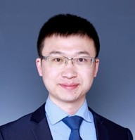

## Gao Huang

### Bio

Gao Huang is an Associate Professor at Tsinghua University, specializing in deep learning, neural networks, and reinforcement learning. His notable work includes DenseNet, which won the CVPR Best Paper Award in 2017. He is also known for his contributions to efficient deep learning and dynamic neural networks.

### Tags
Dynamic neural networks, Efficient deep learning

### Membership
Faculty

### Links

<a href="https://scholar.google.com/scholar?hl=zh-CN&as_sdt=0%2C5&q=gao+huang&btnG=&oq=gao">Personal HomePage</a>

### Publications
#### Densely connected convolutional networks
<a href="https://openaccess.thecvf.com/content_cvpr_2017/papers/Huang_Densely_Connected_Convolutional_CVPR_2017_paper.pdf">paper links</a>

Bib:Gao Huang, Zhuang Liu, Laurens Van Der Maaten, Kilian Weinberger.
IEEE Conference on Computer Vision and Pattern Recognition (CVPR 2017 BestPaper)

Tags: Densely connected convolutional networks

