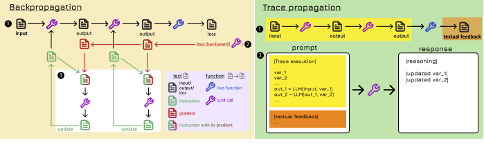
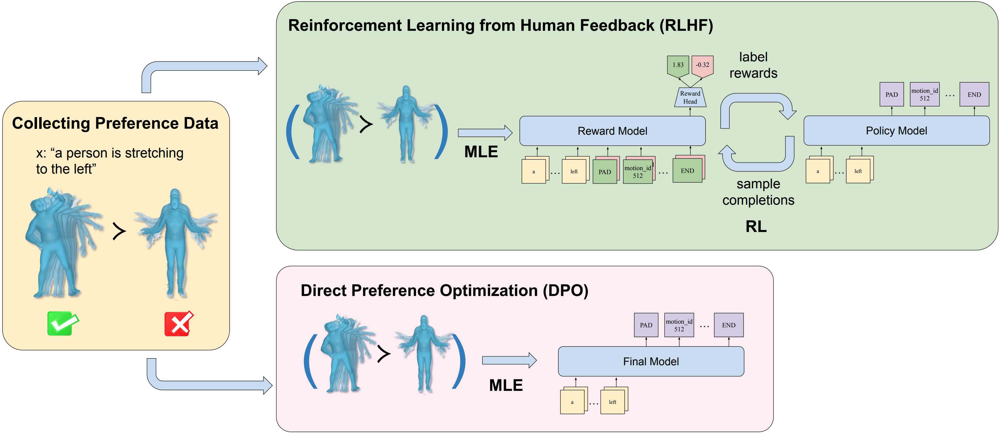
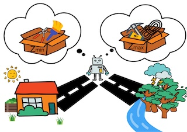

## Matthieu Lin

### Bio

Matthieu Lin is a fourth-year Ph.D. student in the Department of Computer Science at Tsinghua University. He previously earned his Bachelor’s degree from ESIEA Paris and his Master’s degree from Tsinghua University. His research interests lie at the intersection of reinforcement learning and language models. 

### Tags

Reinforcement Learning, LLM

### Membership

PhD Candidate

### Links

<a href="https://linyuhongg.github.io/">Personal HomePage</a>

<a href="https://scholar.google.com/citations?user=2rq3dnsAAAAJ&hl=fr">Google Scholar</a>

### Publications

#### LLM-based Optimization of Compound AI Systems: A Survey

[<a href="https://arxiv.org/abs/2410.16392">paper</a>]

Bib:Matthieu Lin, Jenny Sheng, Andrew Zhao, Shenzhi Wang, Yang Yue, Yiran Wu, Huan Liu, Jun Liu, Gao Huang, Yong-Jin Liu

Tags: LLM, Compound AI Systems

#### Exploring Text-to-Motion Generation with Human Preference

[<a href="https://openaccess.thecvf.com/content/CVPR2024W/HuMoGen/html/Sheng_Exploring_Text-to-Motion_Generation_with_Human_Preference_CVPRW_2024_paper.html">paper</a>]
[<a href="https://github.com/THU-LYJ-Lab/InstructMotion">code</a>]

Bib:Jenny Sheng*, Matthieu Lin*, Andrew Zhao, Kevin Pruvost, Yu-Hui Wen, Yangguang Li, Gao Huang, Yong-Jin Liu
Proceedings of the AAAI Conference on Artificial Intelligence (AAAI 2024 Oral)

Tags: RLHF, Motion Generation

#### A Mixture Of Surprises for Unsupervised Reinforcement Learning

[<a href="https://proceedings.neurips.cc/paper_files/paper/2022/hash/a7667ee5d545a43d2f0fda98863c260e-Abstract-Conference.html">paper</a>]
[<a href="https://github.com/LeapLabTHU/MOSS">code</a>]

Bib:Andrew Zhao*, Matthieu Lin*, Yangguang Li, Yong-jin Liu, Gao Huang.
Advances in Neural Information Processing Systems 35 (NeurIPS 2022)

Tags: Reinforcement Learning, Unsupervised Learning

