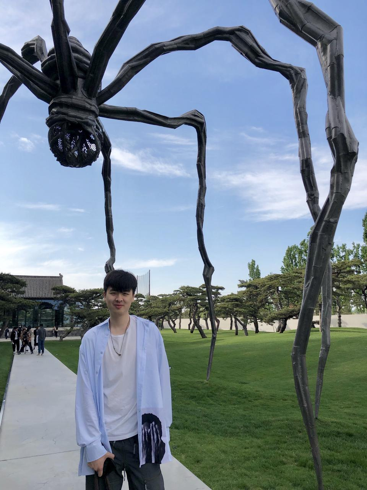
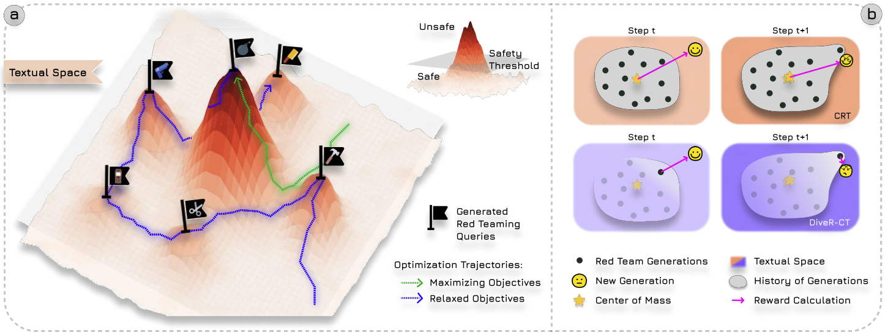
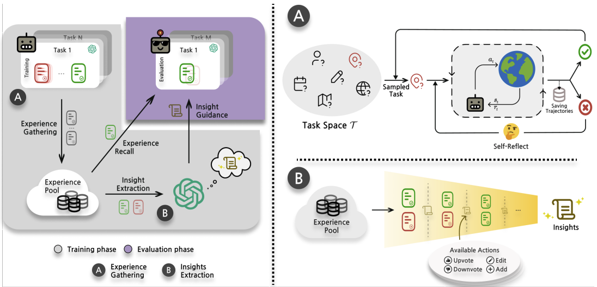
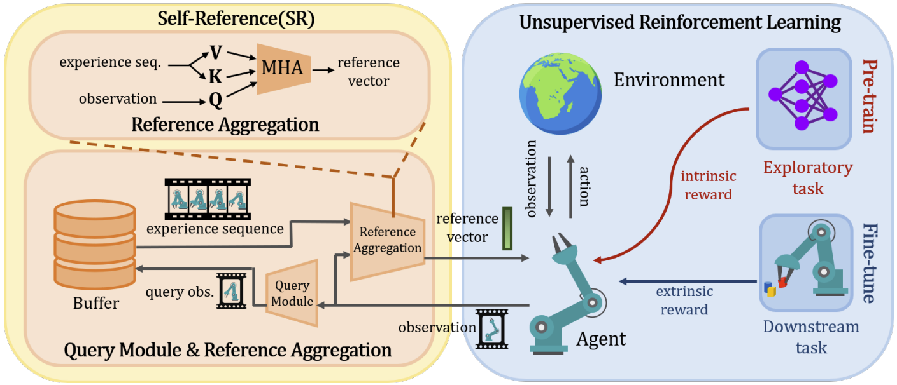
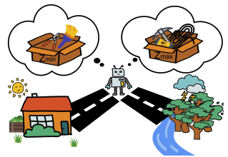

## Andrew Zhao

### Bio

Andrew Zhao is a fourth-year Ph.D. student in the Department of Automation at Tsinghua University, advised by Prof. Gao Huang. He previously earned his Bachelor’s degree from the University of British Columbia and his Master’s degree from the University of Southern California. His research interests include reinforcement learning, LLM-based agents, and LLM reasoning.

### Tags
Reinforcement Learning, LLM Reasoning, LLM-based Agents, Safety

### Membership
PhD Candidate

### Links

<a href="https://andrewzh112.github.io/">Personal HomePage</a>

<a href="https://scholar.google.ca/citations?user=Tlt5xsYAAAAJ&hl=en&authuser=1">Google Scholar</a>

### Publications
#### DiveR-CT: Diversity-enhanced Red Teaming Large Language Model Assistants with Relaxing Constraints
[<a href="https://arxiv.org/abs/2405.19026">paper</a>]
[<a href="https://andrewzh112.github.io/diver-ct">project page</a>]
[<a href="https://github.com/LeapLabTHU/diver-ct">code</a>]

Bib:Andrew Zhao, Quentin Xu, Matthieu Lin, Shenzhi Wang, Yong-jin Liu, Zilong Zheng, Gao Huang.
Proceedings of the AAAI Conference on Artificial Intelligence (AAAI 2025)

Tags: LLM Safety, Adversarial Attacks

#### ExpeL: LLM Agents Are Experiential Learners
[<a href="https://ojs.aaai.org/index.php/AAAI/article/view/29936">paper</a>]
[<a href="https://andrewzh112.github.io/expel">project page</a>]
[<a href="https://github.com/LeapLabTHU/ExpeL">code</a>]

Bib:Andrew Zhao, Daniel Huang, Quentin Xu, Matthieu Lin, Yong-Jin Liu, Gao Huang.
Proceedings of the AAAI Conference on Artificial Intelligence (AAAI 2024 Oral)

Tags: Agents, Experiential Learning

#### Augmenting Unsupervised Reinforcement Learning with Self-Reference
[<a href="https://arxiv.org/abs/2311.09692">paper</a>]

Bib:Andrew Zhao, Erle Zhu, Rui Lu, Matthieu Lin, Yong-Jin Liu, Gao Huang.
Preprint

Tags: Reinforcement Learning, Unsupervised Learning

#### A Mixture Of Surprises for Unsupervised Reinforcement Learning
[<a href="https://proceedings.neurips.cc/paper_files/paper/2022/hash/a7667ee5d545a43d2f0fda98863c260e-Abstract-Conference.html">paper</a>]
[<a href="https://github.com/LeapLabTHU/MOSS">code</a>]

Bib:Andrew Zhao, Matthieu Lin, Yangguang Li, Yong-jin Liu, Gao Huang.
Advances in Neural Information Processing Systems 35 (NeurIPS 2022)

Tags: Reinforcement Learning, Unsupervised Learning

