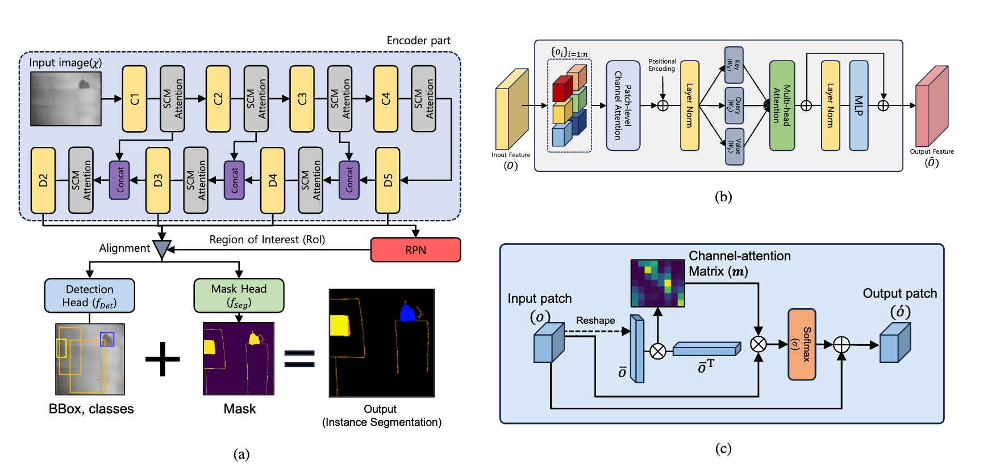

##Chen Chi (Bene)

<a href="chenchi_bene@outlook.com">Email</a>

  

### **Tags**

Visual-tactile manipulation,Tactile Perception, Embodied AI, domain-independent planning.

  
### **Membership**
Visiting Student
  

### **Links**

### **Publications**

#### **Multi-class Road Defect Detection and Segmentation using Spatial and Channel-wise Attention for Autonomous Road Repairing**

<a href="https://arxiv.org/pdf/2402.04064">paper</a>

Authors: Jongmin Yu, Chen Bene Chi, Sebastiano Fichera, Paolo Paoletti, Devansh Mehta, and Shan Luo,

Conference/Journal: 2024 International Conference on Robotics and Automation (ICRA).

Tags: 3D Perception and Spatial Intelligence

