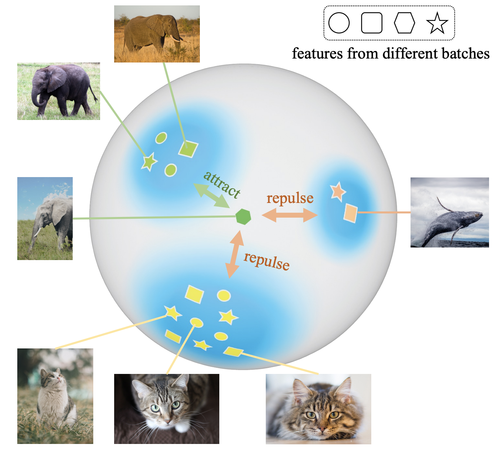
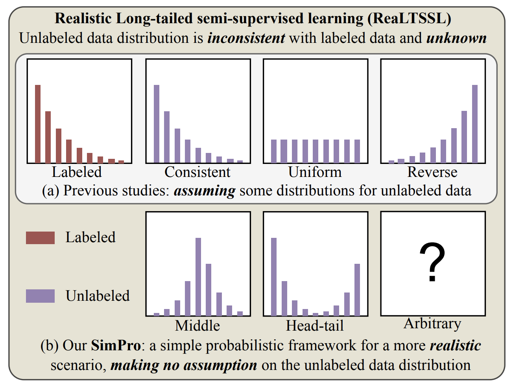
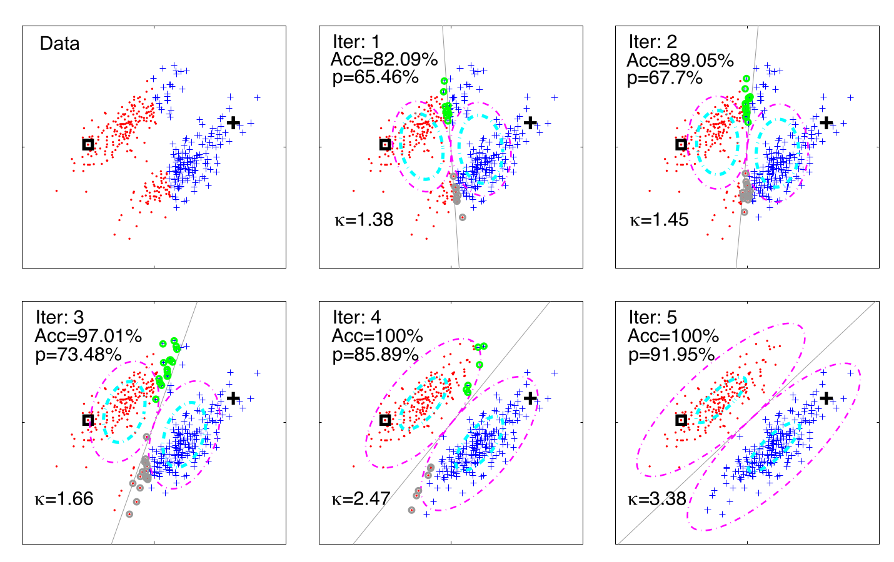
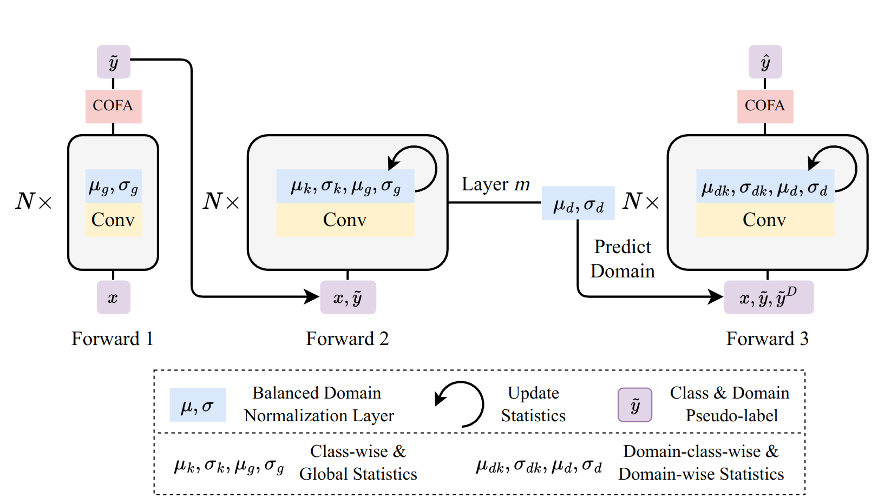

## Chaoqun Du

<a href="dcq20@mails.tsinghua.edu.cn">Email</a>

### Bio

Chaoqun Du is a fifth-year Ph.D. candidate in the Department of Automation at Tsinghua University, advised by Prof. Gao Huang. Prior to this, he earned a Bachelor of Science degree in Mathematics and Physics from the Department of Physics at Tsinghua University in 2020. His research primarily focuses on machine learning under mismatched distribution, including areas such as long-tailed learning and test-time adaptation.

### Tags

Machine Learning, Out-Of-Distribution Generalization

### Membership

Ph.D. Student

### Links

<a href="https://andy-du20.github.io/">Personal HomePage</a>

### Publications

#### Probabilistic Contrastive Learning for Long-Tailed Visual Recognition

<a href="https://arxiv.org/pdf/2403.06726">paper</a>
<a href="https://github.com/LeapLabTHU/ProCo">code</a>

Bib: Chaoqun Du, Yulin Wang, Shiji Song, Gao Huang.
IEEE Transactions on Pattern Analysis and Machine Intelligence (TPAMI 2024)

Tags:

#### SimPro: A Simple Probabilistic Framework Towards Realistic Long-Tailed Semi-Supervised Learning

<a href="https://arxiv.org/pdf/2402.13505">paper</a>
<a href="https://github.com/LeapLabTHU/SimPro">code</a>

Bib: Chaoqun Du, Yizeng Han, Gao Huang.
International Conference on Machine Learning (ICML 2024)

Tags:

#### The High Separation Probability Assumption for Semi-Supervised Learning

<a href="https://ieeexplore.ieee.org/abstract/document/9745190/">paper</a>

Bib: Gao Huang, Chaoqun Du.
IEEE Transactions on Systems, Man, and Cybernetics: Systems

Tags:

#### UniTTA: Unified Benchmark and Versatile Framework Towards Realistic Test-Time Adaptation

<a href="https://arxiv.org/pdf/2407.20080">paper</a>
<a href="https://github.com/LeapLabTHU/UniTTA">code</a>

Bib: Chaoqun Du, Yulin Wang, Jiayi Guo, Yizeng Han, Jie Zhou, Gao Huang.

Tags:

