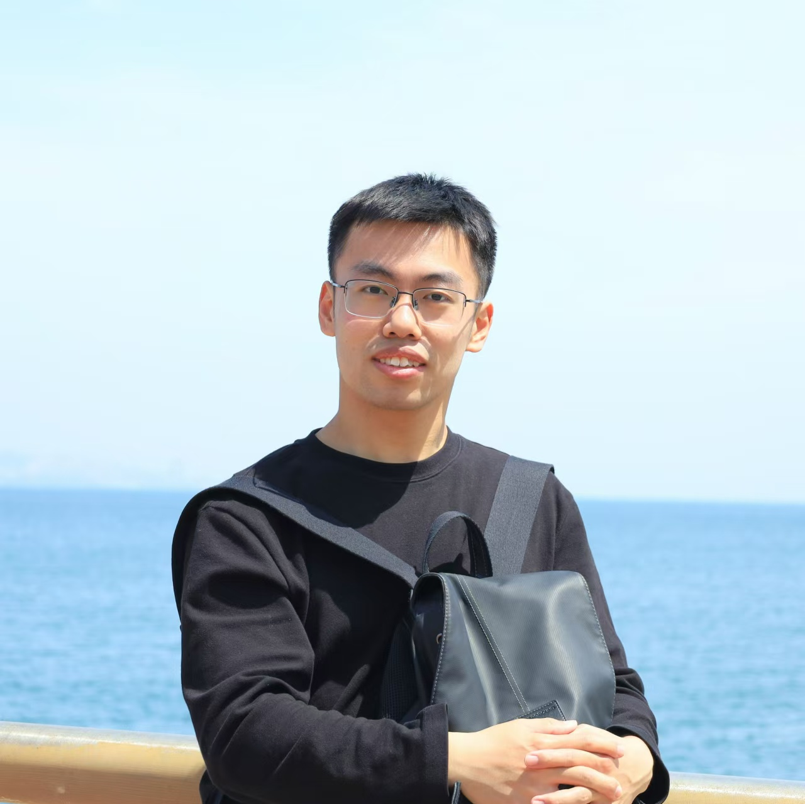
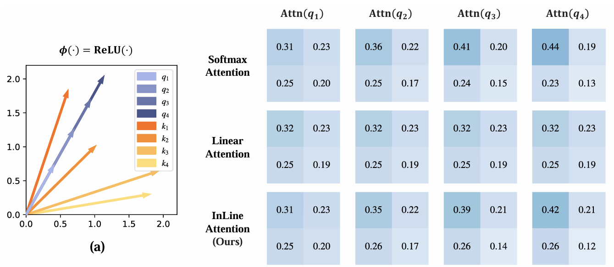
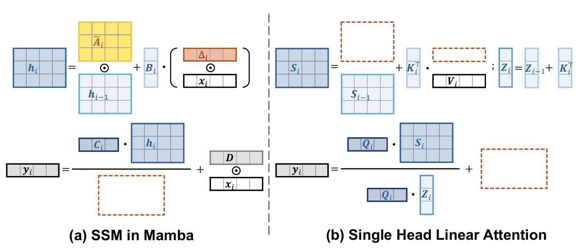
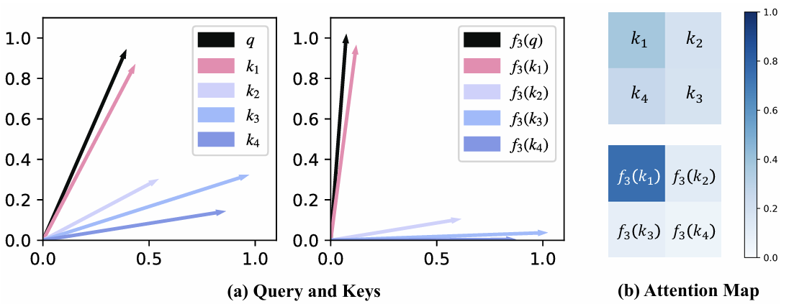

## Dongchen Han

### Bio

Dongchen Han is a second-year Ph.D. student in the Department of Automation at Tsinghua University, under the supervision of Prof. Gao Huang. Prior to that, received Bachelor’s degree in Automation at Tsinghua University in 2023. His research primarily focuses on model architecture design, efficient deep learning, and large multimodal models.

### Tags
Architecture Design for Foundation Models, Computer Vision, Multimodal Learning

### Membership
PhD Candidate

### Links

<a href="https://scholar.google.com/citations?user=wv3U3tkAAAAJ&hl=en">Google Scholar</a>

### Publications
#### Bridging the Divide: Reconsidering Softmax and Linear Attention
[<a href="https://arxiv.org/pdf/2412.06590">paper</a>]
[<a href="https://github.com/LeapLabTHU/InLine">code</a>]
[<a href="https://www.bilibili.com/video/BV1BAqCYnEag">video</a>]

Bib: Dongchen Han, Yifan Pu, Zhuofan Xia, Yizeng Han, Xuran Pan, Xiu Li, Jiwen Lu, Shiji Song, Gao Huang.
Neural Information Processing Systems (NeurIPS) 2024

Tags: Architecture Design for Foundation Models

#### Demystify Mamba in Vision: A Linear Attention Perspective
[<a href="https://arxiv.org/pdf/2405.16605">paper</a>]
[<a href="https://github.com/LeapLabTHU/MLLA">code</a>]
[<a href="https://www.bilibili.com/video/BV1NYzAYxEbZ">video</a>]

Bib: Dongchen Han, Ziyi Wang, Zhuofan Xia, Yizeng Han, Yifan Pu, Chunjiang Ge, Jun Song, Shiji Song, Bo Zheng, Gao Huang.
Neural Information Processing Systems (NeurIPS) 2024

Tags: Architecture Design for Foundation Models

#### Agent Attention: On the Integration of Softmax and Linear Attention
[<a href="https://arxiv.org/pdf/2312.08874">paper</a>]
[<a href="https://github.com/LeapLabTHU/Agent-Attention">code</a>]

Bib: Dongchen Han, Tianzhu Ye, Yizeng Han, Zhuofan Xia, Shiji Song, Gao Huang.
European Conference on Computer Vision (ECCV) 2024

Tags: Architecture Design for Foundation Models

#### FLatten Transformer: Vision Transformer using Focused Linear Attention
[<a href="https://openaccess.thecvf.com/content/ICCV2023/papers/Han_FLatten_Transformer_Vision_Transformer_using_Focused_Linear_Attention_ICCV_2023_paper.pdf">paper</a>]
[<a href="https://github.com/LeapLabTHU/FLatten-Transformer">code</a>]
[<a href="https://www.bilibili.com/video/BV14j41127da/">video</a>]

Bib: Dongchen Han, Xuran Pan, Yizeng Han, Shiji Song, Gao Huang.
International Conference on Computer Vision (ICCV) 2023

Tags: Architecture Design for Foundation Models

