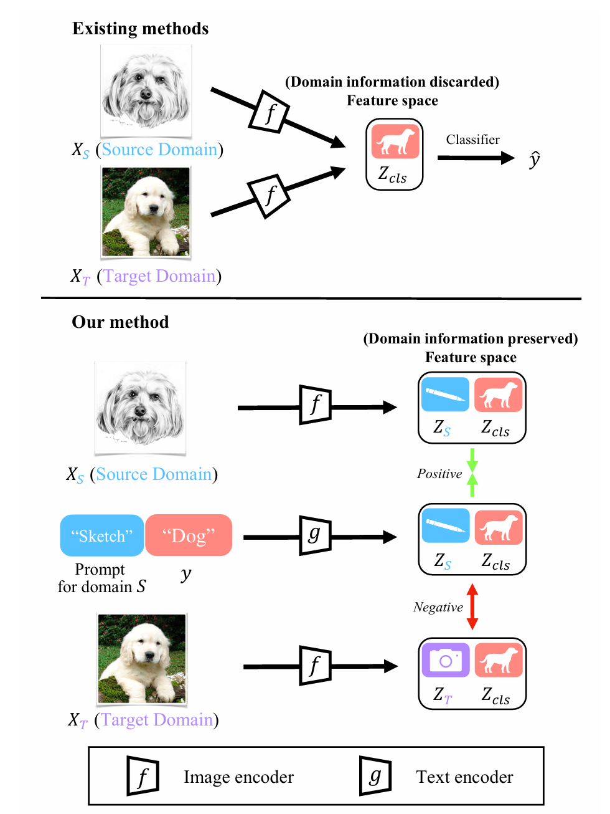
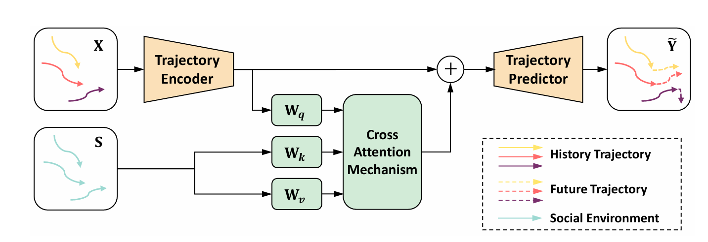
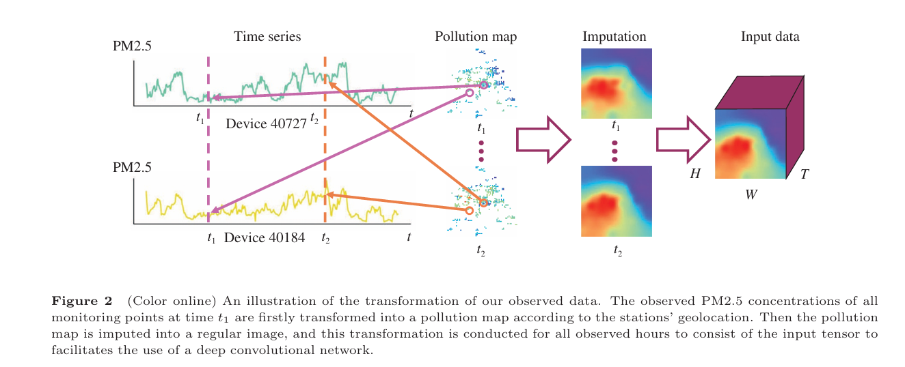

Chunjiang Ge

### Bio

Ge Chunjiang is currently a fifth year PhD candidate in Tsinghua University. My research interest lies in Computer Vision and Multimodal Foundation Models, and the ultimate goals are towards enabling machine learning models to understand the open world, interact with the open world.

### Tags

Vision Understanding and Generation, Multimodal Foundation Models~(MLLMs), Efficient Neural Networks

### Membership

Ph.D Candidate

### Links

<a href="https://john-ge.github.io/">Personal HomePage</a>

### Publications
#### Domain Adaptation via Prompt Learning
<a href="https://arxiv.org/abs/2202.06687">paper links</a>

Bib: Chunjiang Ge, Rui Huang, Mixue Xie, Zihang Lai, Shiji Song, Shuang Li, Gao Huang.
IEEE Transactions on Neural Networks and Learning Systems (TNNLS)

Tags: Domain Adaptation, Prompt Learning

#### Causal Intervention for Human Trajectory Prediction with Cross Attention Mechanism
<a href="https://ojs.aaai.org/index.php/AAAI/article/view/25142">paper links</a>

Bib: Chunjiang Ge, Shiji Song and Gao Huang.
AAAI Conference on Artificial Intelligence (AAAI 2023)

Tags: Causal Intervention, Human Trajectory Prediction, Cross Attention Mechanism

#### Large scale air pollution prediction with deep convolutional networks
<a href="https://link.springer.com/article/10.1007/s11432-020-2951-1">paper links</a>

Bib: Gao Huang$^\ast$, Chunjiang Ge$^\ast$, Tianyu Xiong, Shiji Song, Le Yang, Baoxian Liu, Wenjun Yin and Cheng Wu.
Science China Information Sciences. (IF：8.8)

Tags: Deep Convolutional Networks

