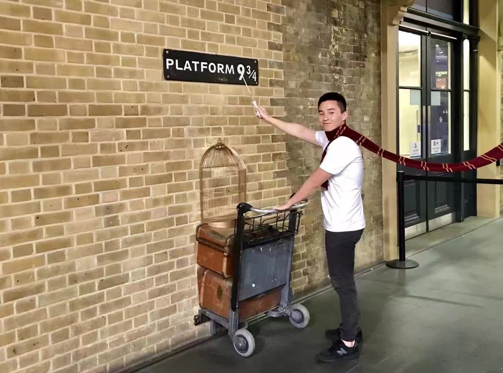
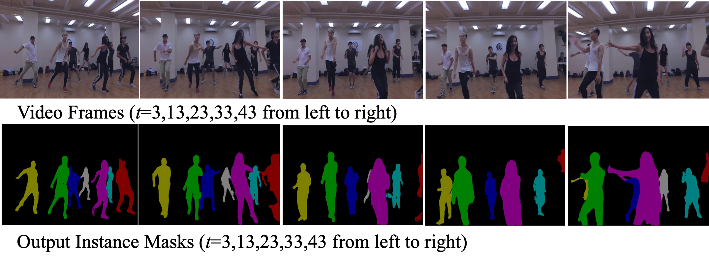
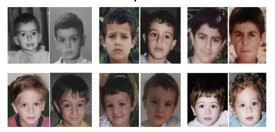

## Hangjian Zhang

### Bio

Hangjian Zhang is a part-time Master student of Engineering Management (MEM) in Tsinghua University advised by Prof. Gao Huang. Also, he is a ML Scientist at CARIAD of VW Group currently. He obtained his M.Sc. from Technische Universität Braunschweig in Germany in 2018, advised by Prof. Marcus Magnor. During summer of 2018, he did internship at Intel Labs as a research intern, advised by Dr. Yimin Zhang and Dr. Haibing Ren . His research primarily focuses on computer vision, efficient deep learning and multimodal learning.

### Tags
Computer Vision, Efficient Deep Learning, Multimodal Learning, LLM-based Agents

### Membership
Master Student

### Links

<a href="https://zhhjemotion.github.io/">Personal HomePage</a>
<a href="https://scholar.google.com/citations?user=8rdberkAAAAJ&hl=en">Google Scholar</a>

### Publications
#### Adaptive video object segmentation with online data generation
[<a href="https://davischallenge.org/challenge2018/papers/DAVIS-Semisupervised-Challenge-4th-Team.pdf">paper</a>]

Bib: Ping Guo*, Lidan Zhang*, Hangjian Zhang, Xiang Liu, Haibing Ren, Yimin Zhang.
IEEE Conference on Computer Vision and Pattern Recognition Workshop (CVPR 2018)

Tags: Weakly-supervised Object Segmentation

#### Automatic Infant Face Verification via Convolutional Neural Network
[<a href="https://diglib.eg.org/server/api/core/bitstreams/8598daa6-32e6-4d5c-a698-58407d2cb06c/content">paper</a>]
[<a href="https://github.com/ZHHJemotion/Infant-Face-Verification">code</a>]

Bib: Hangjian Zhang*, Leslie Wöhler*, Georgia Albuquerque, Marcus Magnor.
The International Symposium on Vision, Modeling, and Visualization (VMV 2018)

Tags: Infant Face Verifcation

