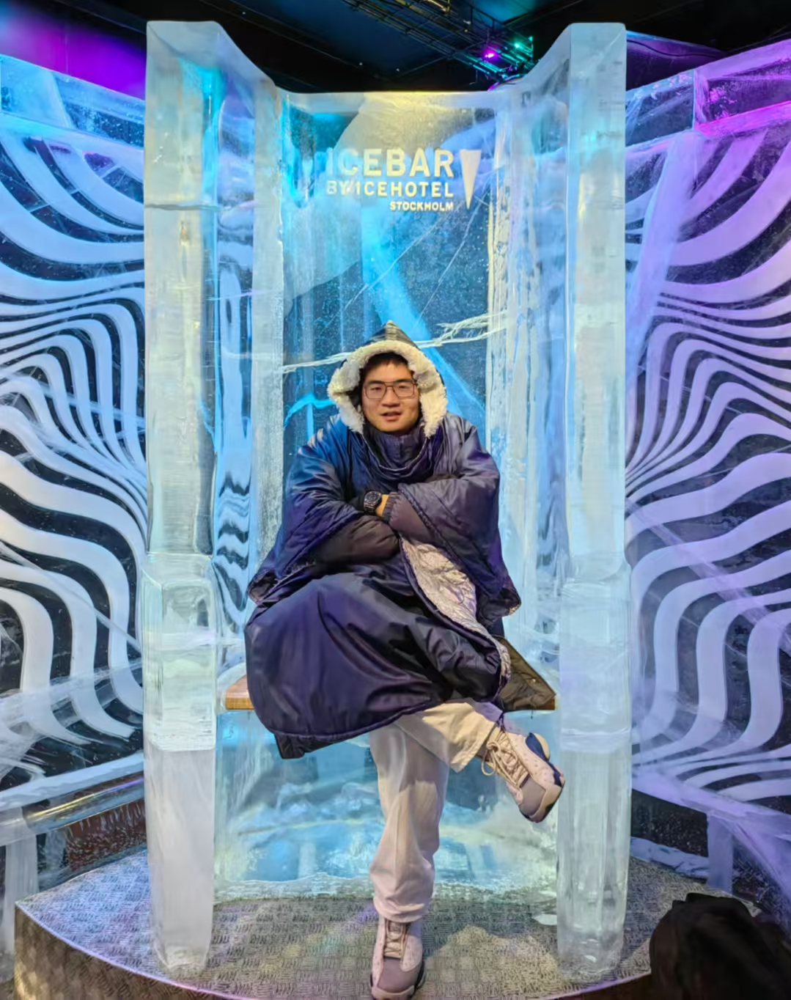
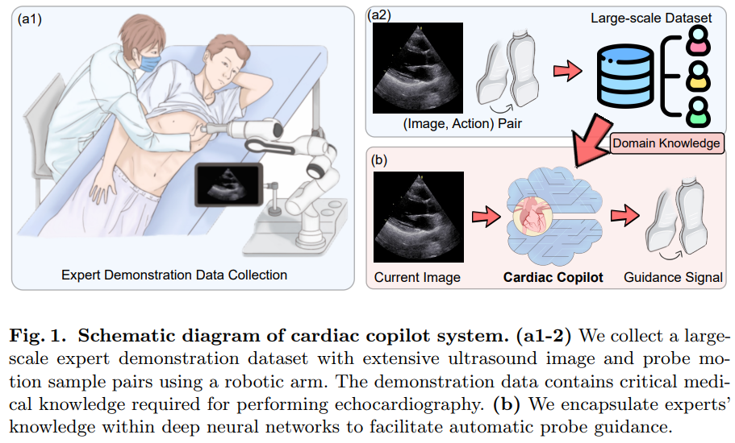
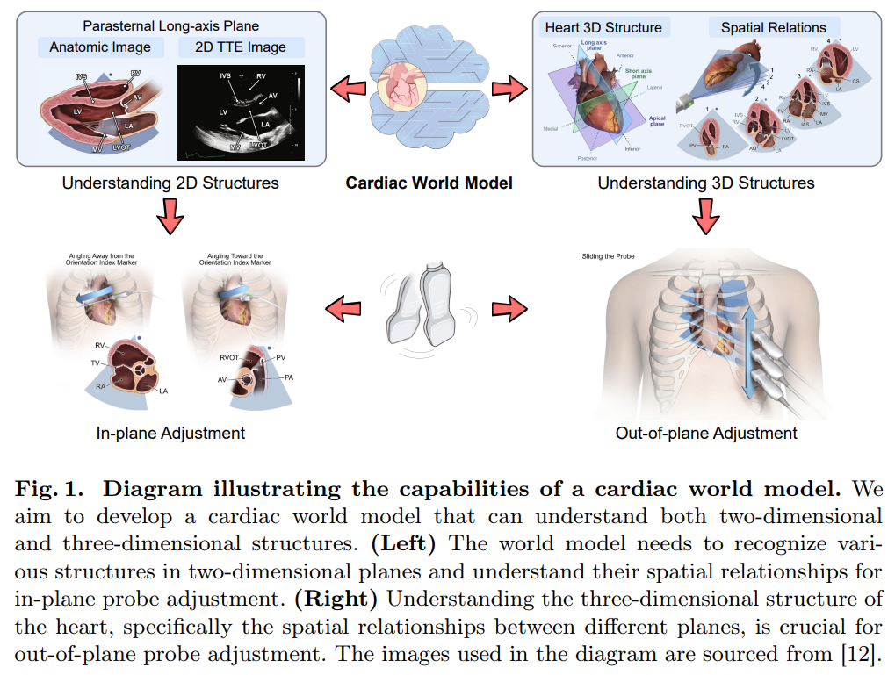
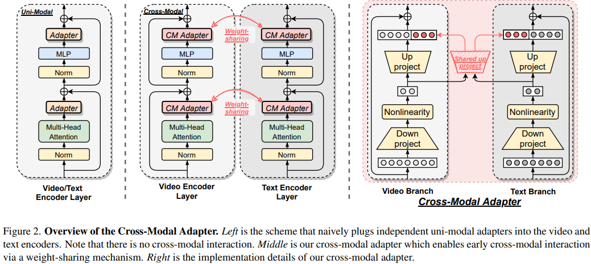
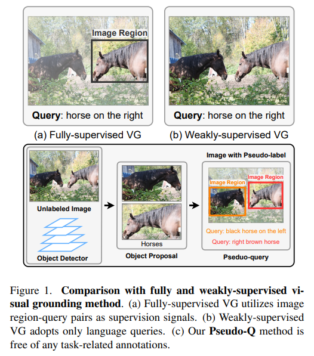
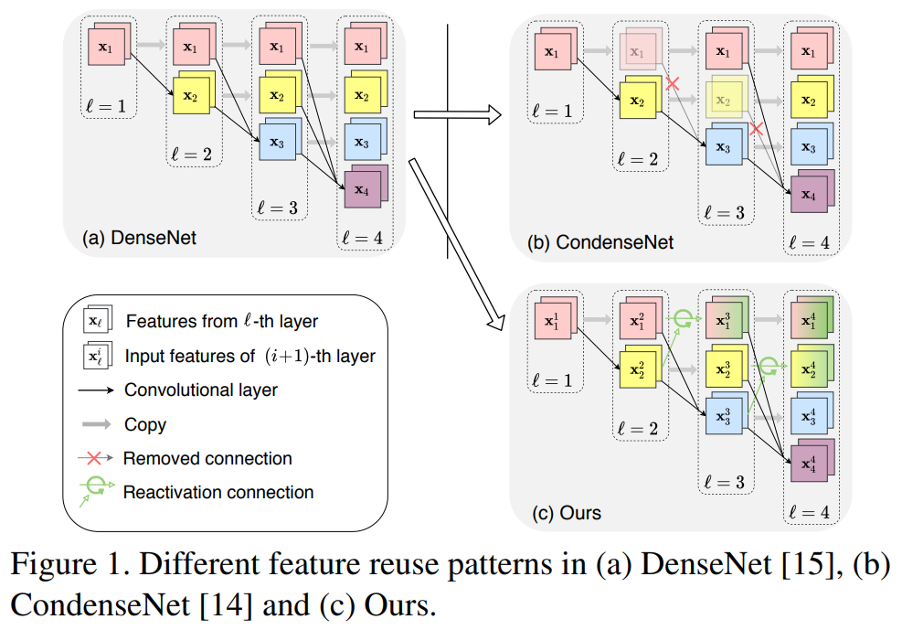

## Yifan Pu

### Bio

Haojun Jiang is a fifth-year Ph.D. student at Tsinghua University, working under the supervision of Prof. Gao Huang. Prior to that, he earned his B.Eng. degree in Automation from Tsinghua University in 2020. His research primarily focuses on embodied artificial intelligence in medical ultrasound.

### Tags
Embodied AI, Multi-modal learning, Efficient Neural Network

### Membership
Ph.D. Student

### Links

<a href="https://github.com/jianghaojun">Github</a>
<a href="https://scholar.google.com/citations?user=ULmStp8AAAAJ&hl=en">Google Scholar</a>

### Publications

#### Cardiac Copilot: Automatic Probe Guidance for Echocardiography with World Model
<a href="https://link.springer.com/chapter/10.1007/978-3-031-72378-0_18">paper</a>

Authors: Haojun Jiang*, Zhenguo Sun*, Ning Jia, Meng Li, Yu Sun, Shaqi Luo, Shiji Song, Gao Huang.
Conference: Medical Image Computing and Computer Assisted Intervention (MICCAI 2024)

Tags: World Model, Probe Guidance, Plane Navigation, Echocardiography

#### Structure-aware World Model for Probe Guidance via Large-scale Self-supervised Pre-train
<a href="https://link.springer.com/chapter/10.1007/978-3-031-73647-6_6">paper</a>

Authors: Haojun Jiang*, Meng Li*, Zhenguo Sun*, Ning Jia, Yu Sun, Shaqi Luo, Shiji Song, Gao Huang.
Journal: Medical Image Computing and Computer Assisted Intervention - ASMUS Workshop (MICCAI-ASMUS 2024)

Tags: World Model, Probe Guidance, Plane Navigation, Echocardiography

#### Cross-modal Adapter for Vision–language Retrieval
<a href="https://www.sciencedirect.com/science/article/pii/S0031320324008951">paper</a>

Authors: Haojun Jiang, Jianke Zhang, Rui Huang, Chunjiang Ge, Zanlin Ni, Shiji Song, Gao Huang
Conference: Pattern Recognition 2025

Tags: Multi-modal learning, Parameter-efficient learning

#### Pseudo-Q: Generating Pseudo Language Queries for Visual Grounding
<a href="https://openaccess.thecvf.com/content/CVPR2022/papers/Jiang_Pseudo-Q_Generating_Pseudo_Language_Queries_for_Visual_Grounding_CVPR_2022_paper.pdf">paper</a>

Authors: Haojun Jiang*, Yuanze Lin*, Dongchen Han, Shiji Song, Gao Huang.
Conference: IEEE Conference on Computer Vision and Pattern Recognition (CVPR 2022)

Tags: Multi-modal learning, Visual Grounding

#### Condensenet v2: Sparse Feature Reactivation for Deep Networks
<a href="https://openaccess.thecvf.com/content/CVPR2021/papers/Yang_CondenseNet_V2_Sparse_Feature_Reactivation_for_Deep_Networks_CVPR_2021_paper.pdf">paper</a>

Authors: Le Yang*, Haojun Jiang*, Ruojin Cai, Yulin Wang, Shiji Song, Gao Huang, Qi Tian.
Conference: European Conference on Computer Vision (ECCV 2024)

Tags: Efficient Neural Network

### Highlights
- National Silver Award/Beijing Gold Award in the 14th "Challenge Cup" Chinese College Student Entrepreneurship Plan Competition, 2024