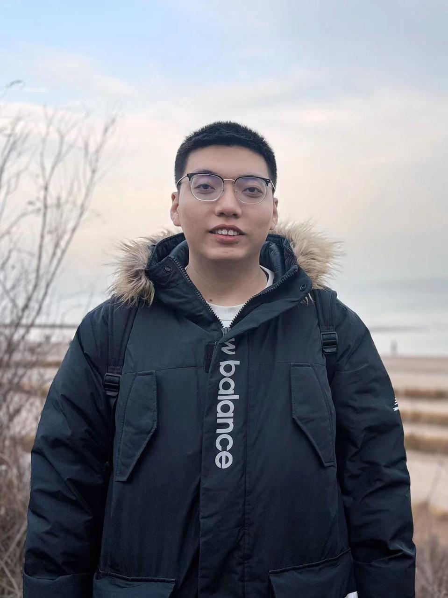
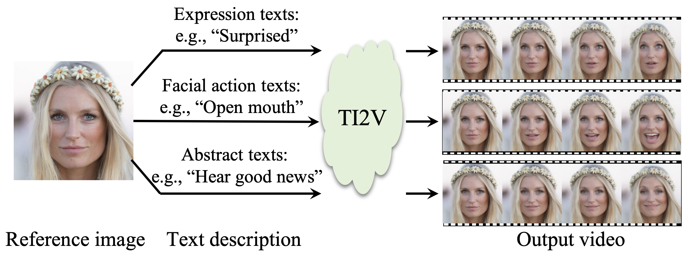
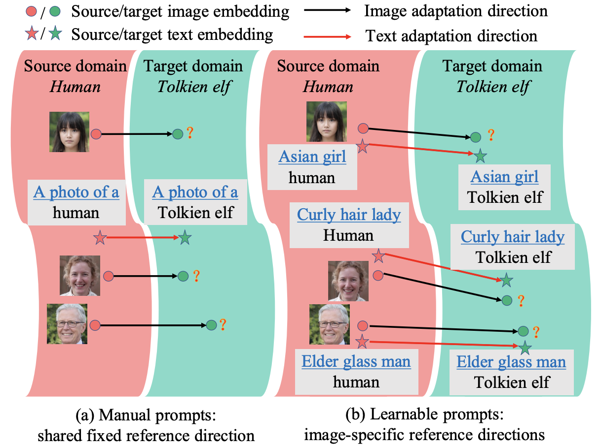
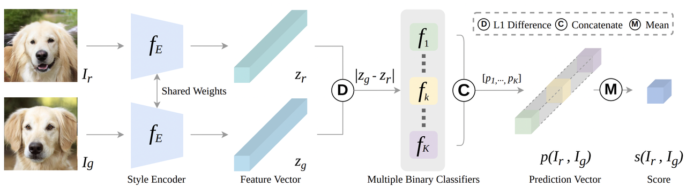

## Jiayi Guo

### Bio

Jiayi Guo is a fifth-year Ph.D. candidate in the Department of Automation at Tsinghua University, advised by Prof. Gao Huang and Prof. Shiji Song. Prior to that, he earned his bachelor degree from the same department in 2020. He was a visiting scholar at Duke University in 2019 and at the Georgia Institute of Technology in 2024. His research interests primarily focus on deep generative models and multimodal learning. 

### Tags
Deep Generative Models, Multimodal Learning, Efficient Deep Learning

### Membership
PhD Candidate

### Links

<a href="https://jiayiguo.net/">Personal HomePage</a>

<a href="https://scholar.google.com/citations?user=2p6GCEEAAAAJ&hl=en">Google Scholar</a>

### Publications
#### FaceCLIP: Facial Image-to-Video Translation via A Brief Text Description
[<a href="https://arxiv.org/pdf/2304.03119.pdf">paper</a>]

Bib:Jiayi Guo, Hayk Manukyan, Chenyu Yang, Chaofei Wang, Levon Khachatryan, Shant Navasardyan, Shiji Song, Humphrey Shi, Gao Huang.
IEEE Transactions on Circuits and Systems for Video Technology (TCSVT 2024)

Tags: Visual Generative Models

#### Smooth Diffusion: Crafting Smooth Latent Spaces in Diffusion Models
[<a href="https://arxiv.org/pdf/2312.04410.pdf">paper</a>]
[<a href="https://github.com/SHI-Labs/Smooth-Diffusion">code</a>]
[<a href="https://shi-labs.github.io/Smooth-Diffusion/">project page</a>]
[<a href="https://www.youtube.com/watch?v=Cr53NZ43nrM">video</a>]

Bib:Jiayi Guo, Xingqian Xu, Yifan Pu, Zanlin Ni, Chaofei Wang, Manushree Vasu, Shiji Song, Humphrey Shi, Gao Huang.
IEEE Conference on Computer Vision and Pattern Recognition (CVPR 2024)

Tags: Visual Generative Models

#### Zero-shot Generative Model Adaptation via Image-specific Prompt Learning
[<a href="https://arxiv.org/pdf/2304.03119.pdf">paper</a>]
[<a href="https://github.com/Picsart-AI-Research/IPL-Zero-Shot-Generative-Model-Adaptation">code</a>]
[<a href="https://www.youtube.com/watch?v=vw9-C3Sz5nM">video</a>]

Bib:Jiayi Guo, Chaofei Wang, You Wu, Eric Zhang, Kai Wang, Xingqian Xu, Shiji Song, Humphrey Shi, Gao Huang.
IEEE Conference on Computer Vision and Pattern Recognition (CVPR 2023)

Tags: Visual Generative Models

#### Assessing a Single Image in Reference-Guided Image Synthesis
[<a href="https://arxiv.org/pdf/2112.04163.pdf">paper</a>]

Bib:Jiayi Guo, Chaoqun Du, Jiangshan Wang, Huijuan Huang, Pengfei Wan, Gao Huang.
AAAI Conference on Artificial Intelligence (AAAI 2022 Oral)

Tags: Visual Generative Models

