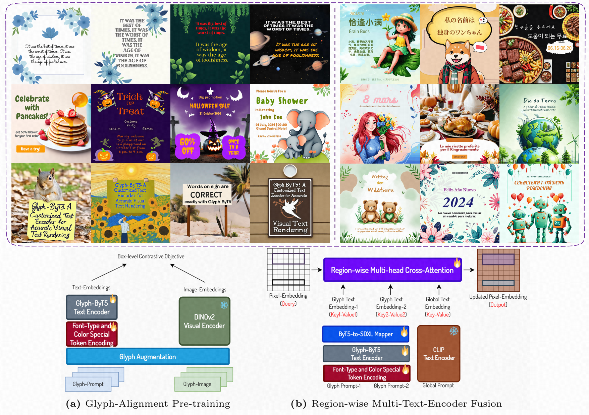
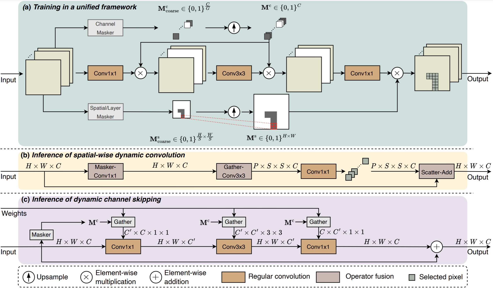
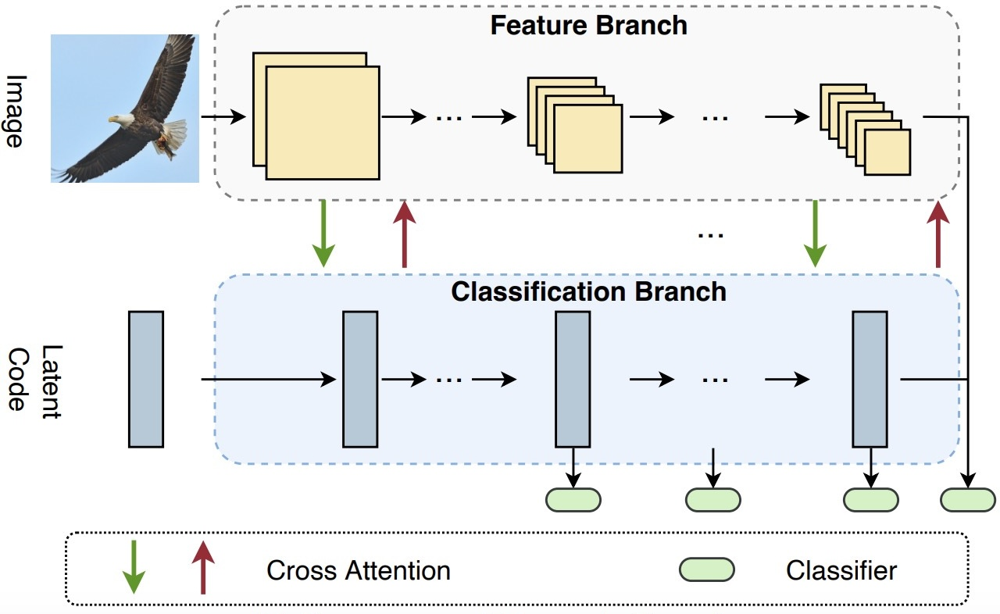

## Andrew Zhao

### Bio

Zeyu Liu is a first-year Ph.D. Student at Tsinghua University, working under the supervision of Prof. Gao Huang. Prior to that, he received his Bachelor degree in computer science from Tsinghua University in 2024. His current research interests includes topics on deep generative models and their applications in Computer Vision and Embodied AI.

### Tags

Generative AI

### Membership

PhD Candidate

### Links

<a href="https://lzy-tony.github.io/">Personal HomePage</a>

<a href="https://scholar.google.com/citations?user=55tpKaoAAAAJ">Google Scholar</a>

### Publications

#### Glyph-ByT5: A Customized Text Encoder for Accurate Visual Text Rendering

[<a href="https://arxiv.org/abs/2403.09622v2">paper</a>]
[<a href="https://glyph-byt5.github.io/">project page</a>]
[<a href="https://github.com/AIGText/Glyph-ByT5">code</a>]

Bib:Zeyu Liu, Weicong Liang, Zhanhao Liang, Chong Luo, Ji Li, Gao Huang, Yuhui Yuan.
European Conference on Computer Vision (ECCV 2024)

Tags: Image Generation, Vision Language

### Latency-aware Unified Dynamic Networks for Efficient Image Recognition

[<a href="https://arxiv.org/abs/2308.15949">paper</a>]
[<a href="https://github.com/LeapLabTHU/LAUDNet">code</a>]

Bib:Yizeng Han, Zeyu Liu, Zhihang Yuan, Yifan Pu, Chaofei Wang, Shiji Song, Gao Huang.

IEEE Transaction on Pattern Analysis and Machine Intelligence (TPAMI 2024)

Tags: Dynamic Neural Networks, Image Recognition

### Dynamic Perceiver for Efficient Visual Recognition

[<a href="https://arxiv.org/abs/2306.11248">paper</a>]
[<a href="https://github.com/LeapLabTHU/Dynamic_Perceiver">code</a>]

Bib:Yizeng Han, Dongchen Han, Zeyu Liu, Yulin Wang, Xuran Pan, Yifan Pu, Chao Deng, Junlan Feng, Shiji Song, Gao Huang.

International Conference on Computer Vision (ICCV 2023)

Tags: Dynamic Neural Networks, Image Recognition

