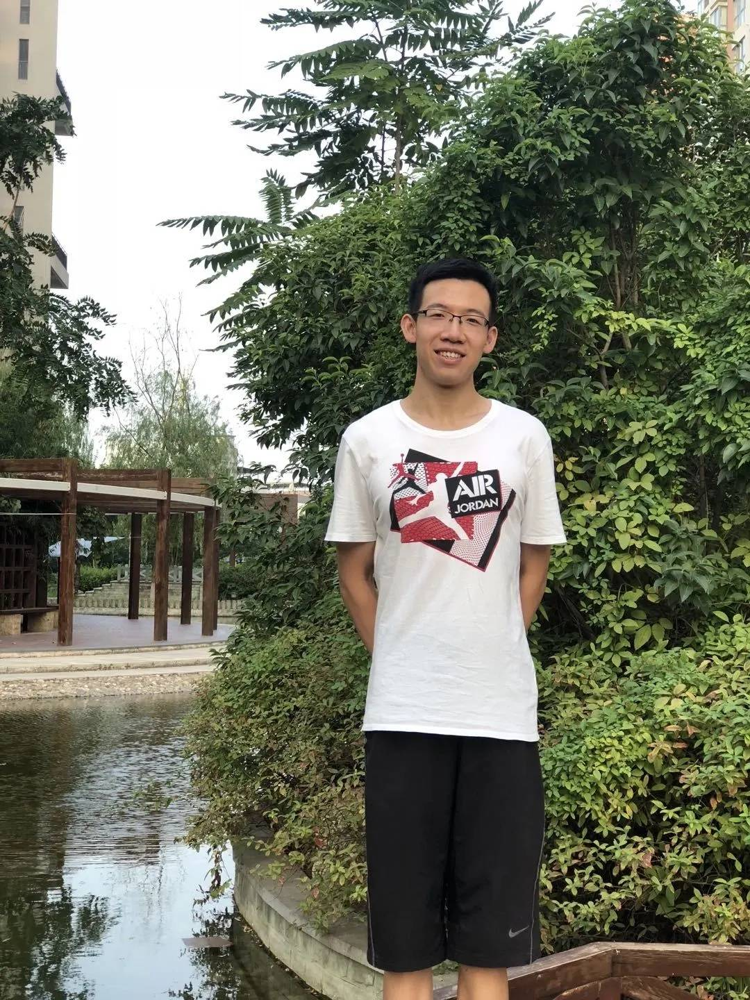
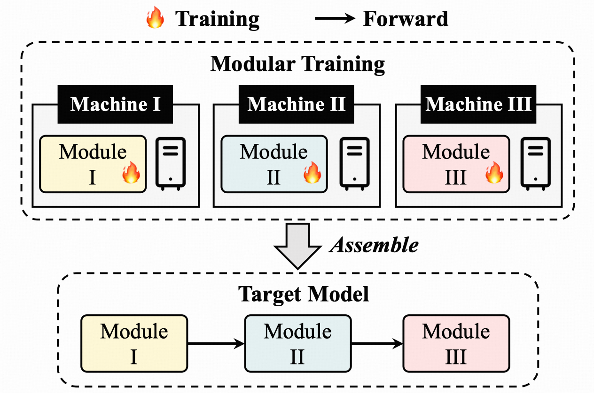

## Zanlin Ni (倪赞林)

<a href="nzl22@mails.tsinghua.edu.cn">Email</a>

Zanlin Ni (倪赞林) is a third-year PhD student in the Department of Automation at Tsinghua University, advised by Prof. Gao Huang. He received the B.S. degree from the Department of Automation, Tsinghua University, Beijing, China, in 2022. His research interests lie on efficient training of large computer vision models and generative models.

### Tags

Computer Vision, Generative Models

### Membership
PhD Students

### Links

<a href="https://scholar.google.com/citations?user=Yibz_asAAAAJ&hl=en&oi=sra">Google Scholar</a>

### Publications

#### Deep Incubation: Training Large Models by Divide-and-Conquering
[<a href="https://openaccess.thecvf.com/content/ICCV2023/papers/Ni_Deep_Incubation_Training_Large_Models_by_Divide-and-Conquering_ICCV_2023_paper.pdf">paper</a>]
[<a href="https://github.com/LeapLabTHU/Deep-Incubation">code</a>]

Bib: Zanlin Ni, Yulin Wang, Jiangwei Yu, Haojun Jiang, Yue Cao, Gao Huang.
International Conference on Computer Vision (ICCV 2023)

Tags: Efficient Deep Learning

#### Revisiting Non-Autoregressive Transformers for Efficient Image Synthesis
[<a href="https://arxiv.org/pdf/2101.10832">paper</a>]
[<a href="https://github.com/LeapLabTHU/ImprovedNAT">code</a>]

Bib: Zanlin Ni, Yulin Wang, Renping Zhou, Jiayi Guo, Jinyi Hu, Zhiyuan Liu, Shiji Song, Yuan Yao, Gao Huang.
IEEE Conference on Computer Vision and Pattern Recognition (CVPR 2024)

Tags: Visual Generative Models

#### AdaNAT: Exploring Adaptive Policy for Token-Based Image Generation
[<a href="https://arxiv.org/pdf/2409.00342">paper</a>]
[<a href="https://github.com/LeapLabTHU/AdaNAT/">code</a>]

Bib: Zanlin Ni, Yulin Wang, Renping Zhou, Rui Lu, Jiayi Guo, Jinyi Hu, Zhiyuan Liu, Yuan Yao, Gao Huang.
European Conference on Computer Vision (ECCV 2024)

Tags: Visual Generative Models

#### ENAT: Rethinking Spatial-temporal Interactions in Token-based Image Synthesis
[<a href="https://arxiv.org/pdf/2411.06959">paper</a>]
[<a href="https://github.com/LeapLabTHU/ENAT">code</a>]

Bib: Zanlin Ni, Yulin Wang, Renping Zhou, Yizeng Han, Jiayi Guo, Zhiyuan Liu, Yuan Yao, Gao Huang.
The Thirty-Eighth Annual Conference on Neural Information Processing Systems (NeurIPS 2024)

Tags: Visual Generative Models

### Highlights

- **SenseTime Scholarship**, SenseTime, 2021  
