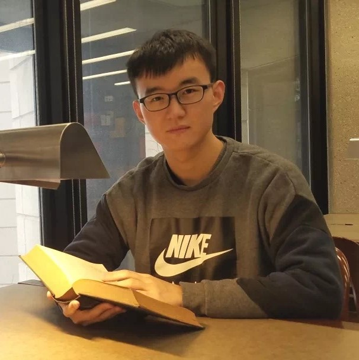
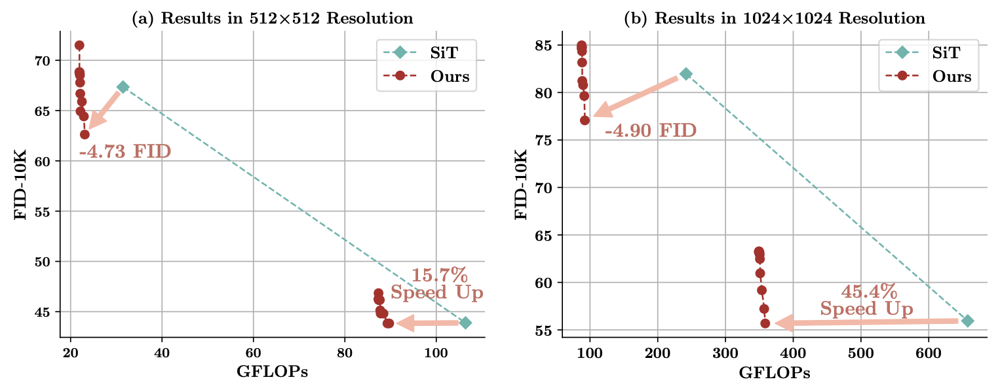
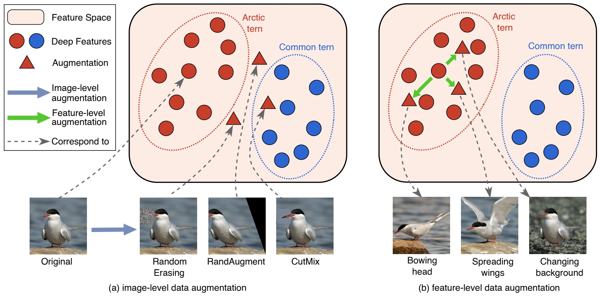
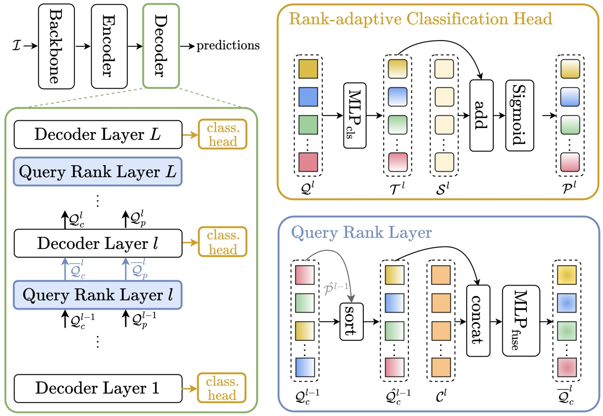
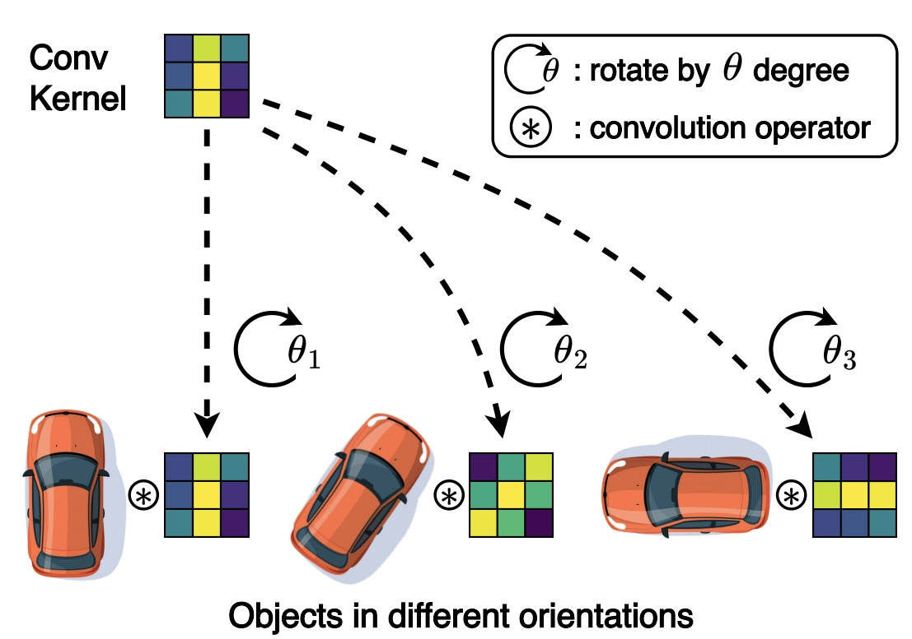
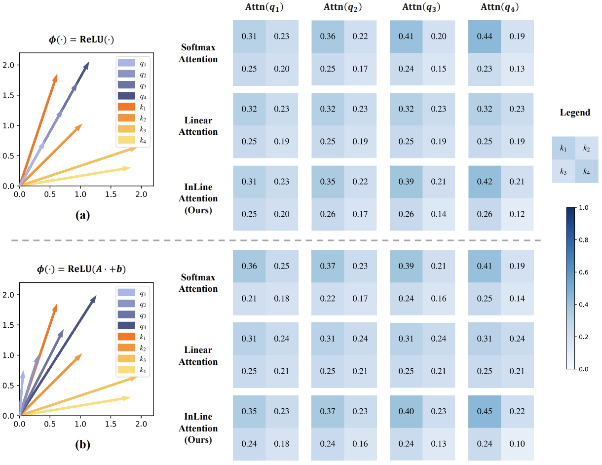
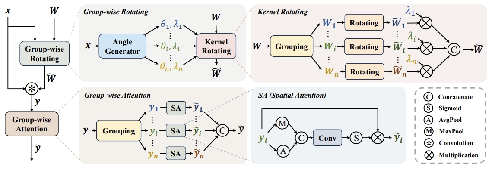
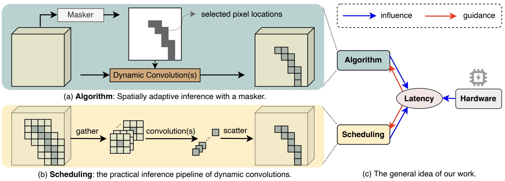
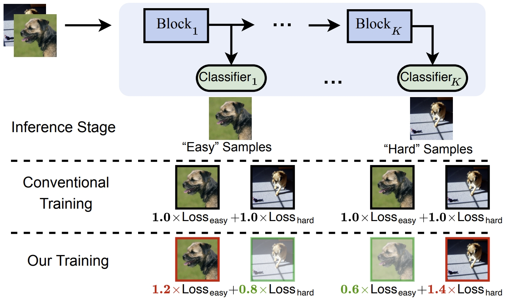

## Yifan Pu

### Bio

Yifan Pu is a fifth-year Ph.D. student at Tsinghua University, working under the supervision of Prof. Gao Huang. He transitioned to the Ph.D. program in Fall 2023 after studying as an M.Sc. student at Tsinghua from Fall 2020. Prior to that, he earned his B.Eng. degree in Automation from Beihang University in 2020. His research primarily focuses on efficient deep learning, particularly dynamic neural networks.

### Tags
Dynamic neural networks, Efficient deep learning, Generative Modeling

### Membership
Ph.D. Student

### Links

<a href="https://github.com/yifanpu001">Github</a>
<a href="https://scholar.google.com/citations?user=oM9rnYQAAAAJ">Google Scholar</a>

Dynamic Neural Networks
Architecture Design for Foundation Models
Large Models and Applications (LLM, MLLM, VLM, VLA, Agents)
Visual Generative Models
3D Perception and Spatial Intelligence
Reinforcement Learning

### Publications

#### Efficient Diffusion Transformer with Step-wise Dynamic Attention Mediators
<a href="https://www.ecva.net/papers/eccv_2024/papers_ECCV/papers/02391.pdf">paper</a>

Authors: Yifan Pu*, Zhuofan Xia*, Jiayi Guo*, Dongchen Han, Qixiu Li, Duo Li, Yuhui Yuan, Ji Li, Yizeng Han, Shiji Song, Gao Huang, Xiu Li.
Conference: European Conference on Computer Vision (ECCV 2024)

Tags: Dynamic Neural Networks, Architecture Design for Foundation Models, Visual Generative Models

#### Fine-grained Recognition with Learnable Semantic Data Augmentation
<a href="https://ieeexplore.ieee.org/abstract/document/10508756/">paper</a>

Authors:Yifan Pu*, Yizeng Han*, Yulin Wang, Junlan Feng, Chao Deng, Gao Huang.
Journal: IEEE Transactions on Image Processing (IEEE TIP 2024)

Tags: Dynamic Neural Networks

#### Rank-DETR for High Quality Object Detection
<a href="https://proceedings.neurips.cc/paper_files/paper/2023/file/34074479ee2186a9f236b8fd03635372-Paper-Conference.pdf">paper</a>

Authors: Yifan Pu*, Weicong Liang*, Yiduo Hao*, Yuhui Yuan, Yukang Yang, Chao Zhang, Han Hu, Gao Huang.
Conference: Advances in Neural Information Processing Systems (NeurIPS 2023)

Tags: Dynamic Neural Networks, Architecture Design for Foundation Models

#### Adaptive Rotated Convolution for Rotated Object Detection
<a href="https://openaccess.thecvf.com/content/ICCV2023/papers/Pu_Adaptive_Rotated_Convolution_for_Rotated_Object_Detection_ICCV_2023_paper.pdf">paper</a>

Authors: Yifan Pu*, Yiru Wang*, Zhuofan Xia, Yizeng Han, Yulin Wang, Weihao Gan, Zidong Wang, Shiji Song, Gao Huang.
Conference: IEEE/CVF International Conference on Computer Vision (ICCV 2023)

Tags: Dynamic Neural Networks, Architecture Design for Foundation Models

#### Bridging the divide: Reconsidering softmax and linear attention
<a href="https://openreview.net/pdf?id=RSiGFzQapl">paper</a>

Authors: Dongchen Han*, Yifan Pu*, Zhuofan Xia, Yizeng Han, Xuran Pan, Xiu Li, Jiwen Lu, Shiji Song, Gao Huang.
Conference: Advances in Neural Information Processing Systems (NeurIPS 2024)

Tags: Architecture Design for Foundation Models

#### GRA: Detecting Oriented Objects through Group-wise Rotating and Attention
<a href="https://www.ecva.net/papers/eccv_2024/papers_ECCV/papers/02600.pdf">paper</a>

Authors: Jiangshan Wang*, Yifan Pu*, Yizeng Han, Jiayi Guo, Yiru Wang, Xiu Li, Gao Huang.
Conference: European Conference on Computer Vision (ECCV 2024)

Tags: Dynamic Neural Networks, Architecture Design for Foundation Models

#### Latency-aware Spatial-wise Dynamic Networks
<a href="https://proceedings.neurips.cc/paper_files/paper/2022/file/ef472869c217bf693f2d9bbde66a6b07-Paper-Conference.pdf">paper</a>

Authors: Yizeng Han*, Zhihang Yuan*, Yifan Pu*, Chenhao Xue, Shiji Song, Guangyu Sun, Gao Huang.
Conference: Advances in Neural Information Processing Systems (NeurIPS 2022)

Tags: Dynamic Neural Networks, Architecture Design for Foundation Models

#### Learning to Weight Samples for Dynamic Early-exiting Networks
<a href="https://www.ecva.net/papers/eccv_2022/papers_ECCV/papers/136710363.pdf">paper</a>

Authors: Yizeng Han*, Yifan Pu*, Zihang Lai, Chaofei Wang, Shiji Song, Junfen Cao, Wenhui Huang, Chao Deng, Gao Huang.
Conference: European Conference on Computer Vision (ECCV 2022)

Tags: Dynamic Neural Networks, Architecture Design for Foundation Models

### Highlights
- First Place in Low Power Computer Vision Challenge, ACM/IEEE ESWEEK, 2023
- First Prize of National Mathematics Competitions, 2017