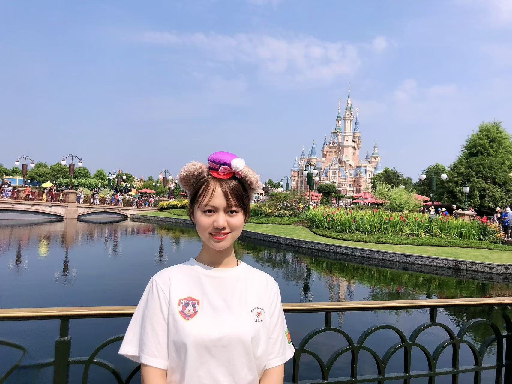

## Wanlan Ren (任挽澜)

<a href="rwl23@mails.tsinghua.edu.cn">Email</a>

Wanlan Ren(任挽澜) is a part-time Master student of Engineering Management (MEM) at Tsinghua University, advised by Prof. Gao Huang. She is also a full-stack software engineer at Microsoft. She earned her Bachelor of Engineering degree from Southwest Jiaotong University in 2018. Her research primarily focuses on LLM-based Agents, Multimodal Learning, and Reinforcement Learning.

### Tags

LLM-based Agents, Multimodal Learning, Reinforcement Learning

### Membership
Part-time Master Students

### Links

### Publications

### Highlights

