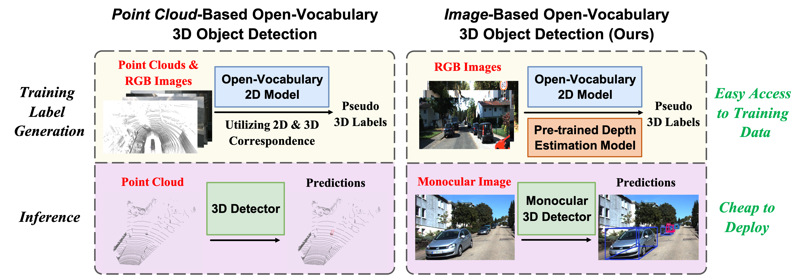
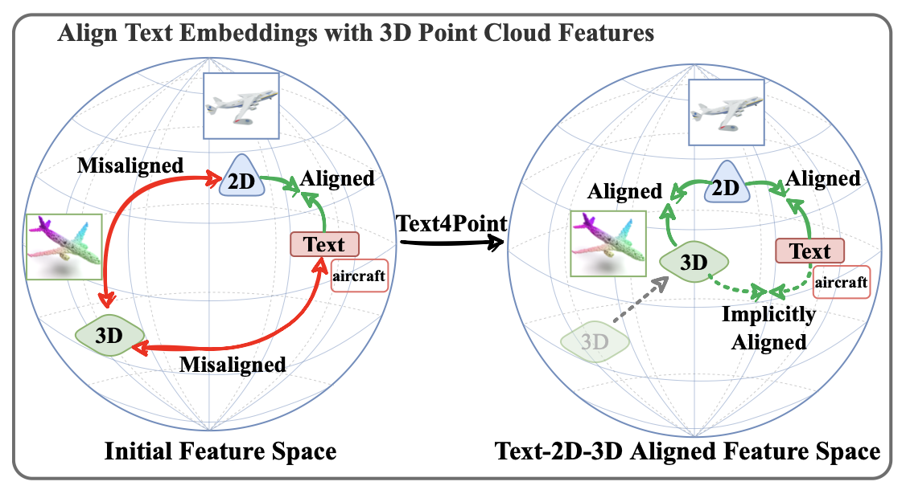
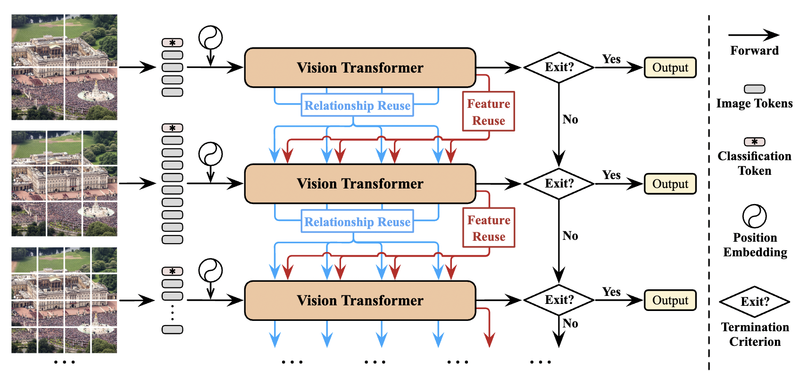

## Rui Huang

### Bio

Rui Huang is a fifth-year Ph.D. candidate in the Department of Automation at Tsinghua University, advised by Prof. Gao Huang and Prof. Cheng Wu. Before this, she earned her Bachelor of Engineering degree from the same department in 2020. Her research primarily focuses on 3D scene understanding and generation, multi-modal learning, and efficient deep learning.

### Tags
3D Scene Understanding and Generation, Multi-modal Learning, Efficient Deep Learning

### Membership
PhD Students

### Links

<a href="https://scholar.google.com/citations?user=ieN4b1QAAAAJ&hl=zh-CN&oi=sra">Google Scholar</a>

### Publications
#### Training an Open-Vocabulary Monocular 3D Object Detection Model without 3D Data
<a href="https://arxiv.org/pdf/2411.15657">paper</a>
<a href="https://ovm3d-det.github.io/">project page</a>
<a href="https://www.youtube.com/watch?v=SEvCJghi6Ng">video</a>

Bib: Rui Huang, Henry Zheng, Yan Wang, Marco Pavone, Gao Huang.
Advances in Neural Information Processing Systems (NeurIPS), 2024.

Tags: 3D Perception and Spatial Intelligence

#### Learning Fine-Grained Class-Agnostic 3D Segmentation without Manual Labels
<a href="https://segment3d.github.io/static/pdf/Segment3D.pdf">paper</a>
<a href="https://segment3d.github.io/">project page</a>
<a href="https://github.com/LeapLabTHU/Segment3D">code</a>
<a href="https://www.youtube.com/watch?v=_OYm-fNrhJg">video</a>

Bib: Rui Huang, Songyou Peng, Ayça Takmaz, Federico Tombari, Marc Pollefeys, Shiji Song, Gao Huang, Francis Engelmann.
European Conference on Computer Vision (ECCV), 2024.

Tags: 3D Perception and Spatial Intelligence

#### Joint Representation Learning for Text and 3D Point Cloud
<a href="https://www.sciencedirect.com/science/article/abs/pii/S0031320323007835">paper</a>

Bib: Rui Huang, Xuran Pan, Henry Zheng, Haojun Jiang, Zhifeng Xie, Cheng Wu, Shiji Song, Gao Huang.
Pattern Recognition (PR), 2023.

Tags: 3D Perception and Spatial Intelligence

#### Not All Images are Worth 16x16 Words: Dynamic Transformers for Efficient Image Recognition
<a href="https://proceedings.neurips.cc/paper/2021/file/64517d8435994992e682b3e4aa0a0661-Paper.pdf">paper</a>

Bib: Yulin Wang*, Rui Huang*, Shiji Song, Zeyi Huang, Gao Huang.
Advances in Neural Information Processing Systems (NeurIPS), 2021.

Tags: Dynamic Neural Networks

