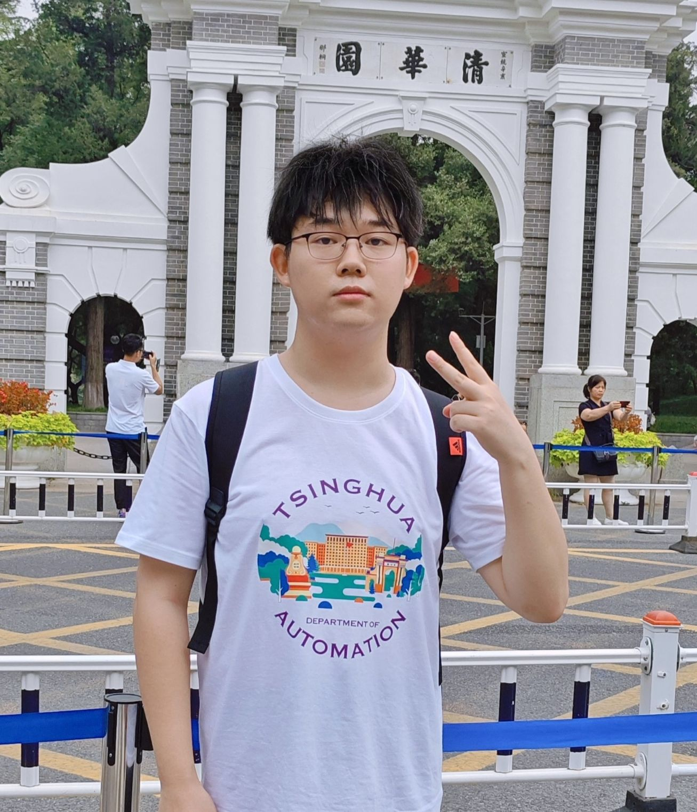
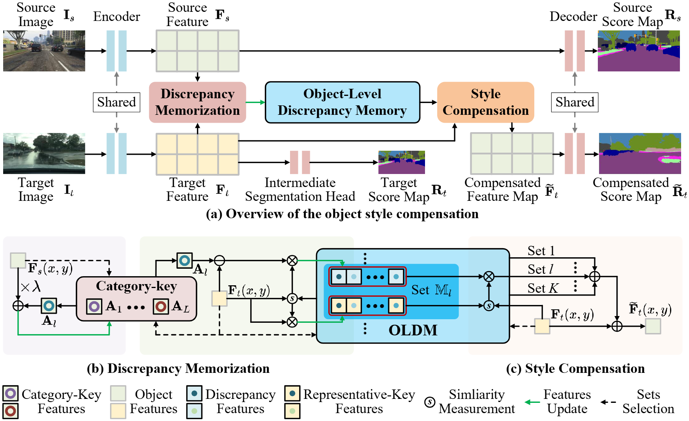

## Hao Shi (石昊)

<a href="shi-h23@mails.tsinghua.edu.cn">Email</a>

Hao Shi (石昊) is a second-year Master's student in the Department of Automation at Tsinghua University, advised by Prof. Gao Huang. He previously earned his Bachelor's degree in Computer Science from the College of Intelligence and Computing at Tianjin University in 2023. His research interests include Computer Vision and Embodied AI.

### Tags

Computer Vision, Embodied AI

### Membership
Master Students

### Links

<a href="https://shihao1895.github.io">Personal HomePage</a>

### Publications
#### DenseGrounding: Improving Dense Language-Vision Semantics for Ego-centric 3D Visual Grounding
[<a href="https://openreview.net/pdf?id=iGafR0hSln">Main Conference Version</a>], [<a href="https://opendrivelab.github.io/Challenge%202024/multiview_THU-LenovoAI.pdf">Workshop Version</a>]

Authors: Henry Zheng\*, **Hao Shi\*** (equal contribution), Qihang Peng, Yong Xien Chng, Rui Huang, Yepeng Weng, Zhongchao Shi, Gao Huang. 

*International Conference on Learning Representations (ICLR 2025) Under Review*

Tags: 3D Perception and Spatial Intelligence

#### Open Compound Domain Adaptation with Object Style Compensation for Semantic Segmentation

[<a href="https://proceedings.neurips.cc/paper_files/paper/2023/file/c74a3a6f44a44b204e26b1a6d7fe4a66-Paper-Conference.pdf">Paper</a>]

Authors: Tingliang Feng\*, **Hao Shi\*** (equal contribution), Xueyang Liu, Wei Feng, Liang Wan, Yanlin Zhou, Di Lin.

*Advances in Neural Information Processing Systems (NeurIPS 2023)*

Tags: Architecture Design for Foundation Models

### Awards

Innovation Award and First Place in the CVPR 2024 Autonomous Grand Challenge Multi-view 3D Visual Grounding Track, IEEE CS, 2024 ($ 9000)

CXMT Scholarship, 2023 (长鑫存储奖学金, 清华大学综合优秀一等奖学金, ￥10000)

Haodushu Scholarship, 2024 (好读书奖学金, 清华大学综合优秀一等奖学金, ￥10000)

