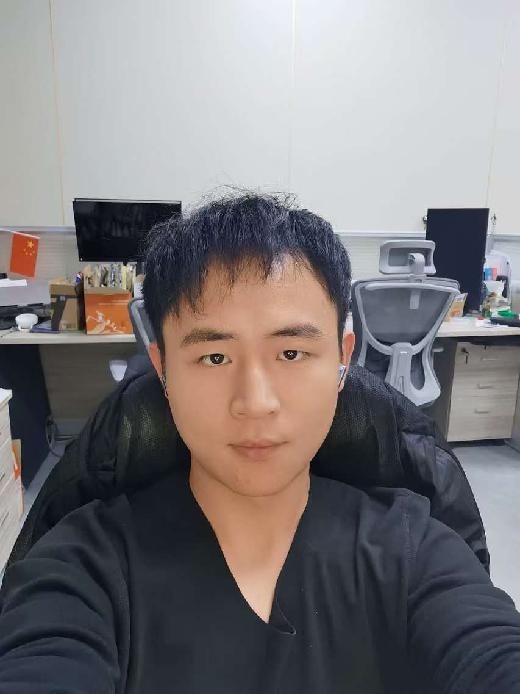

## Zelin Song

### Bio

Zelin Song is a second-year master student in the Department of Automation at Tsinghua University. In 2025, he will join the Leap Lab group to pursue a combined Master's and PhD program. Prior to that, His research primarily focuses on the application of large language models in the medical field.

### Tags
Large Language Model,  Computer Vision

### Membership
PhD Students

### Links

<a href="https://scholar.google.com/citations?view_op=list_works&hl=zh-CN&hl=zh-CN&user=nwf5InkAAAAJ">Google Scholar</a>

### Publications
#### GuKang, a Reliable Dataset for Multi-source Chinese Orthopedic Rehabilitation
<a href="https://ieeexplore.ieee.org/abstract/document/10718741">paper links</a>

Bib: Zelin Song; Tao Xue; Pinjie Li; Ming Zhang; Tao Zhang