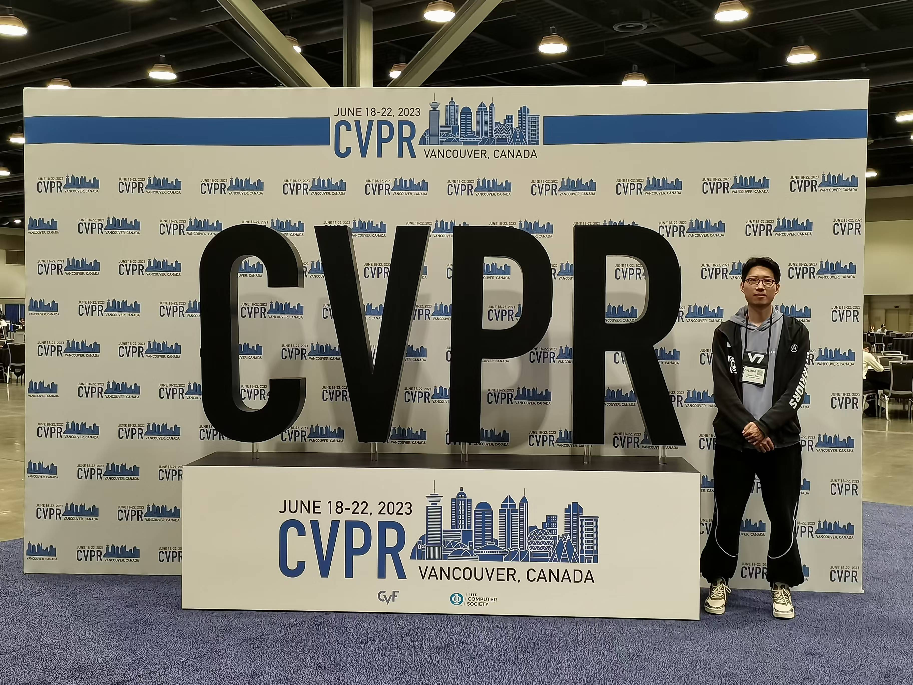
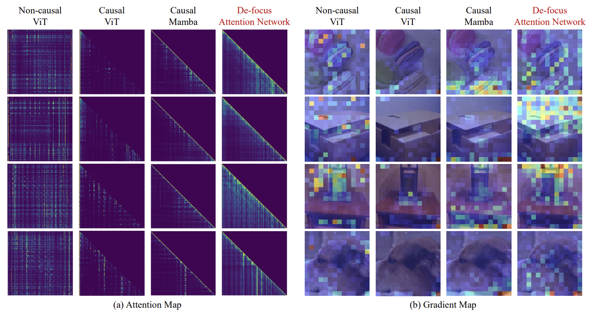
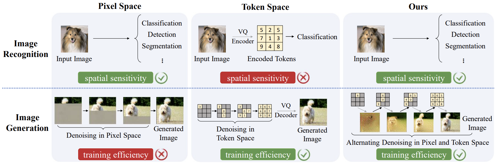
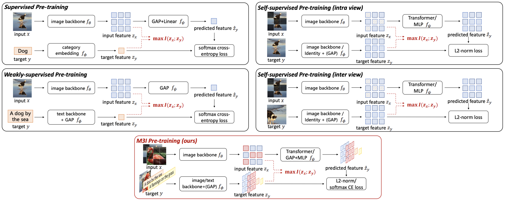
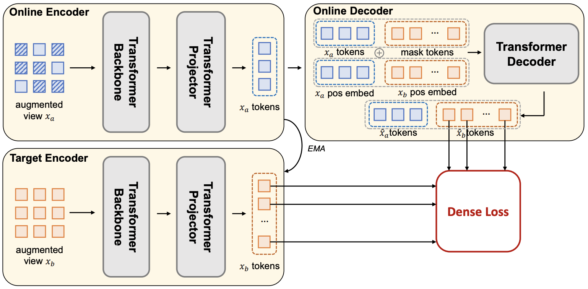
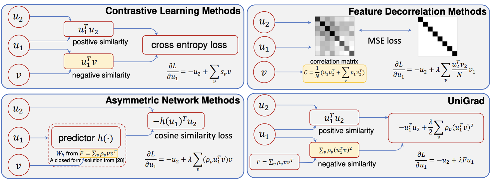

## Chenxin Tao

### Bio

Chenxin Tao is  a fifth-year Ph.D. candidate in the Department of Automation at Tsinghua University, advised by Prof. Gao Huang and Prof. Cheng Wu. Prior to this, he earned a  Bachelor of Science degree in Mathematics and Physics from the Department of Physics at Tsinghua University in 2020. His research primarily focuses on general representation learning, including building general visual representations and unified multi-modal representations.

### Tags
Representation Learning, Self-supervised Learning, Multi-modal Models.

### Membership
PhD Students

### Links

<a href="https://scholar.google.com/citations?user=sXHFIBkAAAAJ&hl=zh-CN">Google Scholar</a>

### Publications
#### Learning 1D Causal Visual Representation with De-focus Attention Networks
<a href="https://arxiv.org/pdf/2406.04342">paper</a>
<a href="https://github.com/OpenGVLab/De-focus-Attention-Networks">code</a>

Bib: Chenxin Tao*, Xizhou Zhu*, Shiqian Su*, Lewei Lu, Changyao Tian, Xuan Luo, Gao Huang, Hongsheng Li, Yu Qiao, Jie Zhou, Jifeng Dai.
Advances in Neural Information Processing Systems (NeurIPS), 2024.

Tags: Multi-modal Models

#### ADDP: Learning General Representations for Image Recognition and Generation with Alternating Denoising Diffusion Process
<a href="https://arxiv.org/pdf/2306.05423">paper</a>
<a href="https://github.com/ChangyaoTian/ADDP">code</a>

Bib: Changyao Tian*, Chenxin Tao*, Jifeng Dai, Hao Li, Ziheng Li, Lewei Lu, Xiaogang Wang, Hongsheng Li, Gao Huang, Xizhou Zhu.
International Conference on Learning Representations (ICLR), 2024.

Tags: Representation Learning

#### Towards All-in-one Pre-training via Maximizing Multi-modal Mutual Information
<a href="https://arxiv.org/pdf/2211.09807">paper</a>

Bib: Weijie Su*, Xizhou Zhu*, Chenxin Tao*, Lewei Lu, Bin Li, Gao Huang, Yu Qiao, Xiaogang Wang, Jie Zhou, Jifeng Dai.
IEEE Conference on Computer Vision and Pattern Recognition (CVPR), 2023.

Tags: Representation Learning, Self-supervised Learning

#### Siamese Image Modeling for Self-supervised Vision Representation Learning
<a href="https://arxiv.org/abs/2206.01204">paper</a>
<a href="https://github.com/OpenGVLab/Siamese-Image-Modeling">code</a>

Bib: Chenxin Tao*, Xizhou Zhu*, Weijie Su*, Gao Huang, Bin Li, Jie Zhou, Yu Qiao, Xiaogang Wang, Jifeng Dai.
IEEE Conference on Computer Vision and Pattern Recognition (CVPR), 2023.

Tags: Representation Learning, Self-supervised Learning

#### Exploring the Equivalence of Siamese Self-supervised Learning via A Unified Gradient Framework
<a href="https://arxiv.org/abs/2112.05141">paper</a>
<a href="https://github.com/fundamentalvision/UniGrad">code</a>

Bib: Chenxin Tao*, Honghui Wang*, Xizhou Zhu*, Jiahua Dong*, Shiji Song, Gao Huang, Jifeng Dai.
IEEE Conference on Computer Vision and Pattern Recognition (CVPR), 2022.

Tags: Representation Learning, Self-supervised Learning

