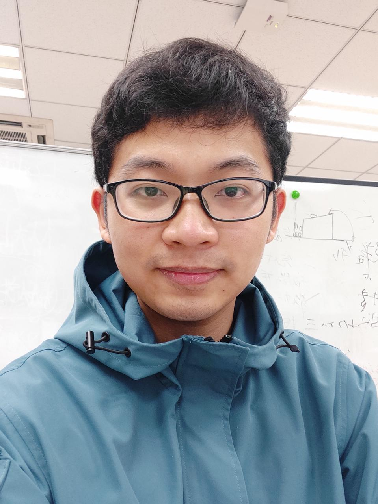
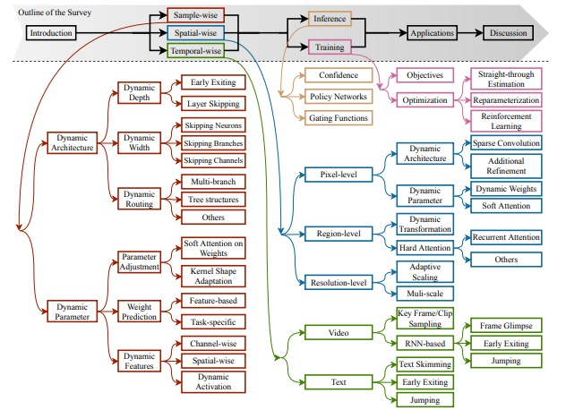
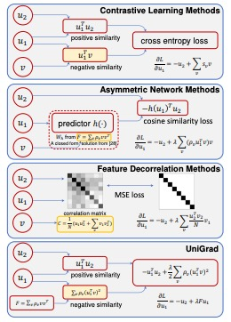
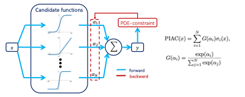
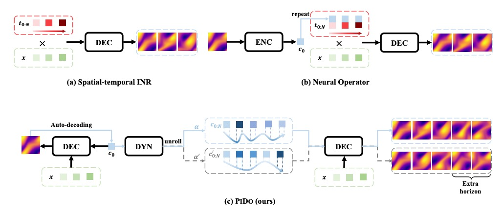

## Honghui Wang
<!--  -->

### Bio

Honghui Wang is a fifth-year Ph.D. candidate in the Department of Automation at Tsinghua University, under the supervision of Prof. Gao Huang and Prof. Shiji Song. He earned his Bachelor of Engineering degree from the same department in 2020. His research primarily focuses on physics-informed neural networks and operator learning.

### Tags
Physics-informed neural networks; Operator learning

### Membership
PhD Students

### Links

<a href="https://scholar.google.com/citations?user=FzJ1aIsAAAAJ&hl=en">Personal HomePage</a>

### Publications
#### Dynamic Neural Networks: A Survey
<a href="https://arxiv.org/pdf/2102.04906">paper</a>

Authors: Yizeng Han, Gao Huang, Shiji Song, Le Yang, **Honghui Wang**, and Yulin Wang. 
(*TPAMI*).

Tags: Dynamic Neural Networks

<!--  -->

#### Exploring the Equivalence of Siamese Self-Supervised Learning via A Unified Gradient Framework
<a href="https://openaccess.thecvf.com/content/CVPR2022/papers/Tao_Exploring_the_Equivalence_of_Siamese_Self-Supervised_Learning_via_a_Unified_CVPR_2022_paper.pdf">paper</a>

Authors: Chenxin Tao*, **Honghui Wang***, Xizhou Zhu*, Jiahua Dong*, Shiji Song, Gao Huang, Jifeng Dai. 
(*CVPR 2022*).

Tags: Architecture Design for Foundation Models

<!--  -->

#### Learning Specialized Activation Functions for Physics-Informed Neural Networks
<a href="https://global-sci.org/intro/article_detail.html?journal=undefined&article_id=22125">paper</a>

Authors: **Honghui Wang**, Lu Lu, Shiji Song, Gao Huang. 
(*CiCP*).

Tags: Architecture Design

<!--  -->

#### Advancing Generalization in PINNs through Latent-Space Representations
<a href="https://arxiv.org/pdf/2411.19125">paper</a>

Authors: **Honghui Wang**, Yifan Pu, Shiji Song, Gao Huang. 

Tags: Architecture Design

<!--  -->
