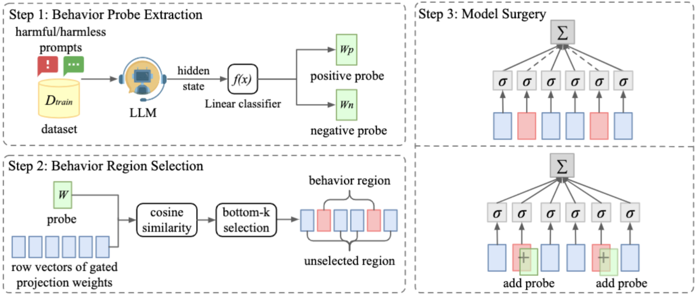

## Huanqian Wang (王洹芊)

<a href="wang-hq23@mails.tsinghua.edu.cn">Email</a>

### Bio

Huanqian Wang is a PHD Student at Tsinghua University, specializing in AI safety and Embodied AI.

### Tags
AI safety, Embodied AI

### Membership
PHD Student

### Links

<a href="https://github.com/lucywang720">GitHub</a>

### Publications

#### Leveraging reward consistency for interpretable feature discovery in reinforcement learning
[<a href="https://arxiv.org/pdf/2309.01458">paper</a>]

Bib: Qisen Yang, Huanqian Wang, Mukun Tong, Wenjie Shi, Gao Huang, Shiji Song (TSMC-A)

Tags: Reinforcement Learning

#### Model Surgery: Modulating LLM's Behavior via Simple Parameter Editing

Bib: Huanqian Wang, Yang Yue, Rui Lu, Jingxin Shi, Andrew Zhao, Shenzhi Wang, Shiji Song, Gao Huang

[Full Version] [<a href="https://arxiv.org/abs/2407.08770">paper</a>]

Under Review

Tags: LLM safety alignment

