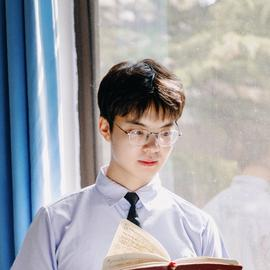
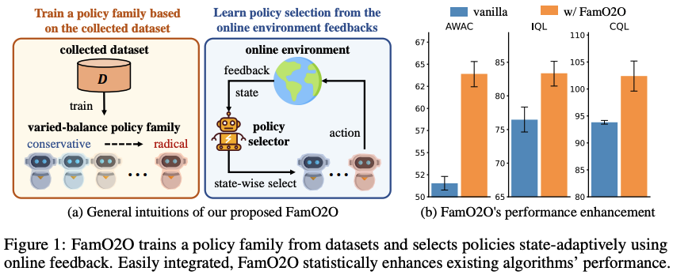
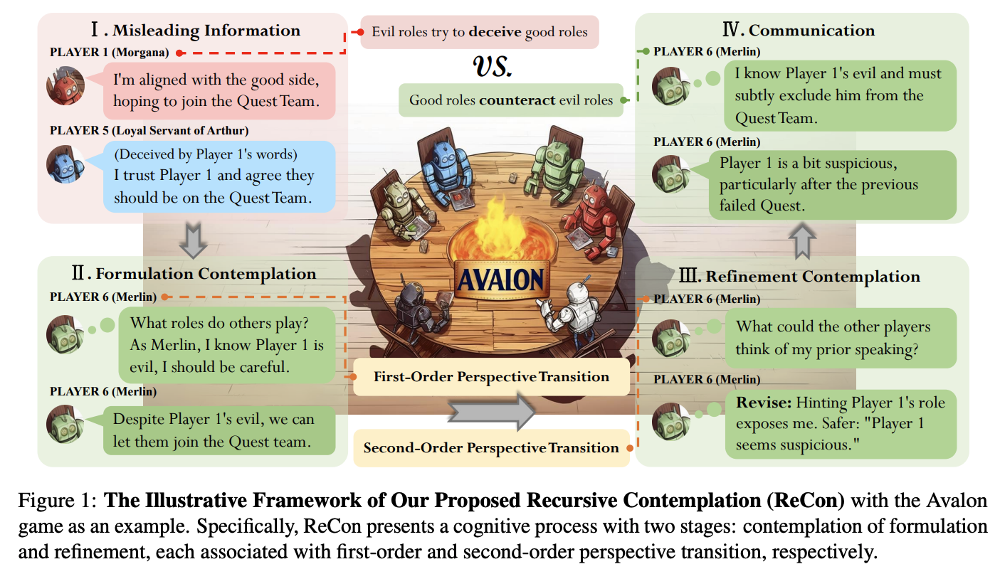
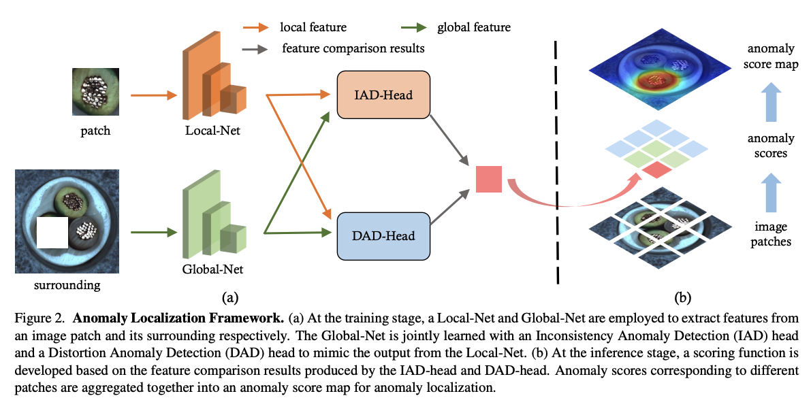

## Shenzhi Wang

### Tags

Reinforcement Learning, Large Language Model, LLM-based Agents, Computer Vision

### Membership

PhD Students

### Links

<a href="https://shenzhi-wang.netlify.app/">Personal HomePage</a>
<a href="https://scholar.google.com/citations?user=Xgt7njgAAAAJ">Google Scholar</a>

### Publications

#### Train once, get a family: State-adaptive balances for offline-to-online reinforcement learning

[<a href="https://arxiv.org/abs/2310.17966">arxiv</a>]
[<a href="https://shenzhi-wang.github.io/NIPS_FamO2O/">project page</a>]
[<a href="https://github.com/LeapLabTHU/FamO2O">code</a>]

Bib: Shenzhi Wang, Qisen Yang, Jiawei Gao, Matthieu Gaetan Lin, Hao Chen, Liwei Wu, Ning Jia, Shiji Song, Gao Huang

37th Conference on Neural Information Processing Systems (NeurIPS 2023), **Spotlight**.

Tags: Reinforcement Learning

#### Boosting LLM Agents with Recursive Contemplation for Effective Deception Handling (Avalon's Game of Thoughts: Battle Against Deception through Recursive Contemplation)

[<a href="https://aclanthology.org/2024.findings-acl.591.pdf">paper</a>]

[<a href="https://arxiv.org/abs/2310.01320">arxiv</a>]

[<a href="https://shenzhi-wang.github.io/avalon_recon/">project page</a>]

[<a href="https://github.com/Shenzhi-Wang/recon">code</a>]

Bib: Shenzhi Wang, Chang Liu, Zilong Zheng, Siyuan Qi, Shuo Chen, Qisen Yang, Andrew Zhao, Chaofei Wang, Shiji Song, Gao Huang

Findings of the Association for Computational Linguistics: ACL 2024

Tags: Large Models and Applications (LLM, MLLM, VLM, VLA, Agents)

#### Glancing at the Patch: Anomaly Localization With Global and Local Feature Comparison

[<a href="https://openaccess.thecvf.com/content/CVPR2021/papers/Wang_Glancing_at_the_Patch_Anomaly_Localization_With_Global_and_Local_CVPR_2021_paper.pdf">paper</a>]

Bib: Shenzhi Wang, Liwei Wu, Lei Cui, Yujun Shen
Conference on Computer Vision and Pattern Recognition (CVPR 2021)

Tags: Computer Vision

