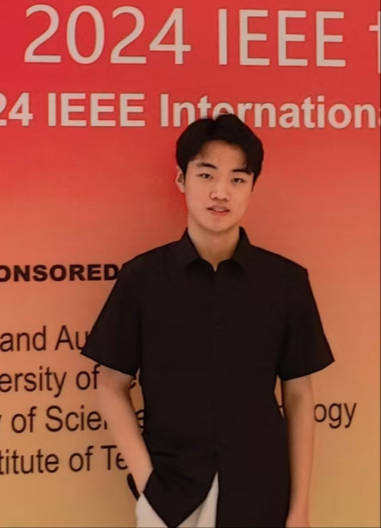

## Teng Wang

<a herf="tengwang2002@gmail.com">tengwang2002@gmail.com</a>

### Bio

Teng Wang is a visiting student at Tsinghua University, under the supervision of Prof. Gao Huang. His research primarily focuses on embodied AI.

### Tags
Embodied AI, Reinforcement Learning, Computer Vision

### Membership

Intern / Visiting student

### Highlights

- National Scholarship
- National Gold Award of China International College Students’ Innovation Competition, 2023