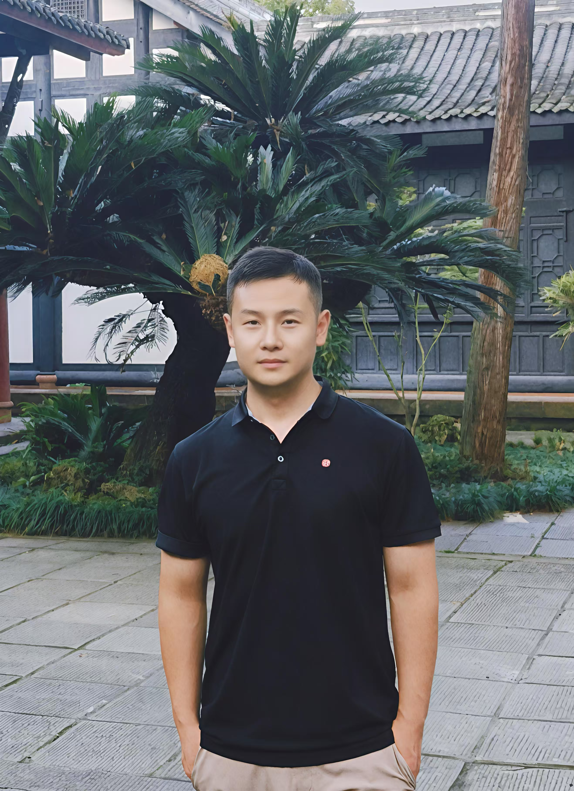
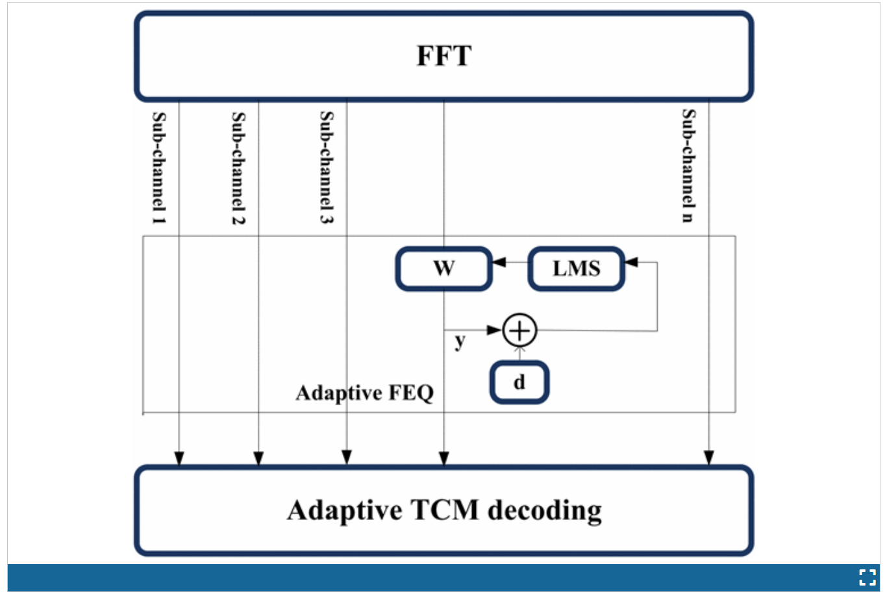
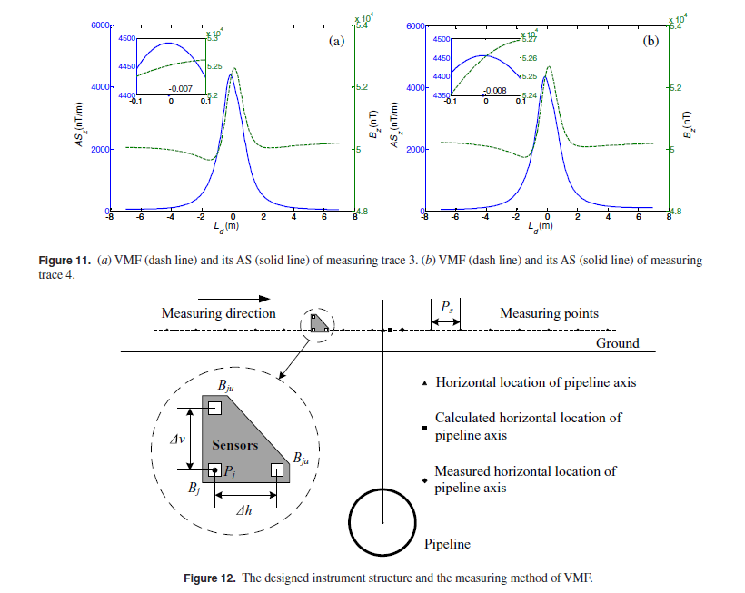

## George Wang

<a href="https://brainleap.ai/">Personal HomePage</a>

### Bio
George Wang is a part-time Master student of Engineering Management (MEM) in Tsinghua University advised of Prof. Gao Huang. Also, he is the founder of BrainLeap.Inc. He was in charge of ML engineering team of XiaoHongShu. He obtained his M.Sc from China University of Petroleum in 2016 advised by Prof. Dejun Liu. His research primarily focuses on Embodied AI, computer vision and multimodal learning

Tags
Large Models and Applications(LLM, MLLM, VLM, VLA, Agents), Visual Generative Models

Membership
Master Students

Links
<a href="https://brainleap.ai/">Personal HomePage</a>

Publications
Publications按照如下格式：文章名（带全文链接），作者，发表期刊/会议（全文+简写，可参考黄老师的个人主页www.gaohuang.net），年份。
A Frequency Domain Scheme for High Speed Telemetry down Hole Wire Line Communication
<a href="https://ieeexplore.ieee.org/abstract/document/7406081/authors#authors">paper</a>

Authors: Zheng Wang; Dejun Liu; Qinghui Ai; Xing Cheng; Dahuan Xue; Aidong Yang.
Conference/Journal: IEEE Conference on Instrumentation, Measurement, Computer, Communication and Control (IMCCC 2015)

Tags: Architecture Design

Vertical magnetic field and its analytic signal applicability in oil field underground pipeline detection
<a href="https://academic.oup.com/jge/article-pdf/12/3/340/26783655/jge_12_3_340.pdf">paper</a>

Authors: Zhiyong Guo, Dejun Liu, Qi Pan, Yingying Zhang, Yi Li, Zheng Wang.
Conference/Journal: Journal of Geophysics and Engineering ( 2015)

Tags: Computer Vision and Pattern Recognition

