## Yulin Wang

  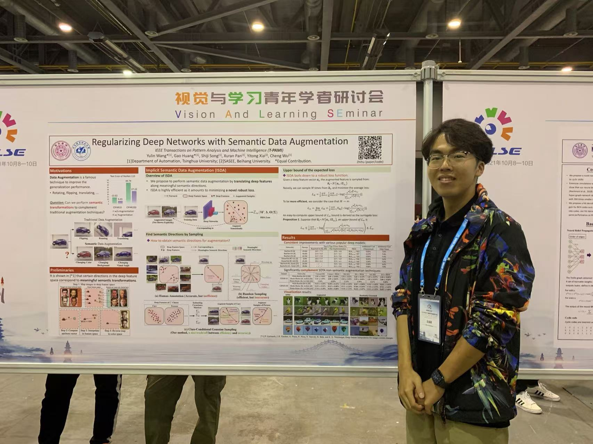

### Bio

Yulin Wang is a Ph.D. student in the Department of Automation at Tsinghua University, advised by Prof. Gao Huang and Prof. Cheng Wu. Before that, he received his B.E. degree in Automation at Beihang University in 2019. He was a research intern at Berkeley DeepDrive, U.C. Berkeley, in 2018.

His research focuses on addressing the challenges of data efficiency and computational efficiency in building large-scale deep learning models (e.g., visual/multi-modal foundation models, generative models, and embodied foundation models for robotics).

### Tags
Dynamic Neural Networks, Architecture Design for Foundation Models, Efficient Learning of Foundation Models, Large Models and Applications (LLM, MLLM, VLM, VLA, Agents), Visual Generative Models, Reinforcement Learning

### Membership
PhD Student

### Links

[<a href="https://www.wyl.cool">Personal Homepage</a>] | 
[<a href="https://www.wyl.cool/files/wyl_cv.pdf">Curriculum Vitae (12/2024)</a>] | 
[<a href="https://scholar.google.com/citations?user=gBP38gcAAAAJ&hl=en">Google Scholar</a>]

### Selected Publications (see <a href="https://www.wyl.cool">Personal Homepage</a> for the full list)

#### Uni-AdaFocus: Spatial-temporal Dynamic Computation for Video Recognition
[<a href="https://arxiv.org/pdf/2412.11228">paper link</a>] | [<a href="https://github.com/LeapLabTHU/Uni-AdaFocus">code link</a>]

Bib: **Yulin Wang**, Haoji Zhang, Yang Yue, Shiji Song, Chao Deng, Junlan Feng, Gao Huang.

IEEE Transactions on Pattern Analysis and Machine Intelligence (**TPAMI** 2024, IF=20.8)

Tags: Dynamic Neural Networks, Architecture Design for Foundation Models, Reinforcement Learning

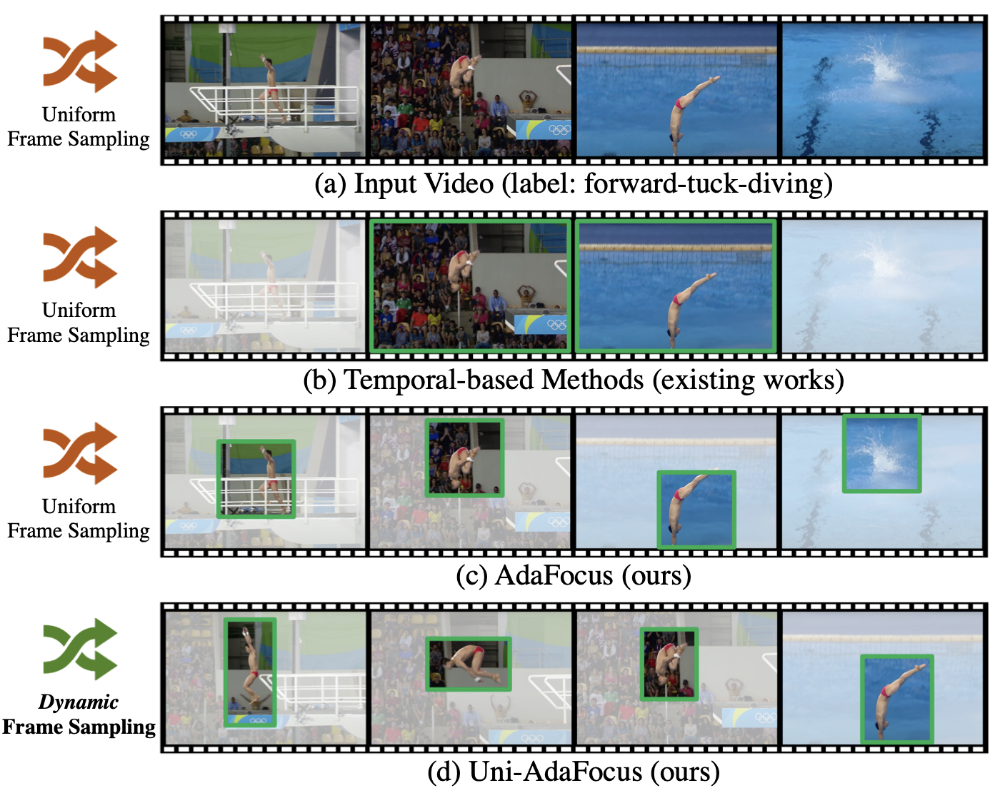

---

#### EfficientTrain++: Generalized Curriculum Learning for Efficient Visual Backbone Training
[<a href="https://arxiv.org/pdf/2405.08768">paper link</a>] | [<a href="https://github.com/LeapLabTHU/EfficientTrain">code link</a>] | [<a href="https://mp.weixin.qq.com/s/GsFXuNpZAF98bc7uMvOBCA">机器之心</a>]

Bib: **Yulin Wang**, Yang Yue, Rui Lu, Yizeng Han, Shiji Song, Gao Huang.

IEEE Transactions on Pattern Analysis and Machine Intelligence (**TPAMI** 2024, IF=20.8)

Tags: Efficient Learning of Foundation Models

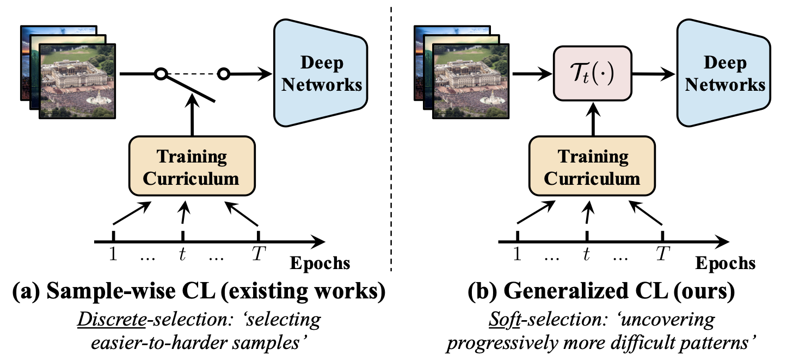

---

#### Probabilistic Contrastive Learning for Long-Tailed Visual Recognition
[<a href="https://arxiv.org/pdf/2403.06726">paper link</a>] | [<a href="https://github.com/LeapLabTHU/ProCo">code link</a>] | [<a href="https://mp.weixin.qq.com/s/qjWdQRiax8NOOan-e1r0Ww">机器之心</a>]

Bib: Chaoqun Du, **Yulin Wang**, Shiji Song, Gao Huang.

IEEE Transactions on Pattern Analysis and Machine Intelligence (**TPAMI** 2024, IF=20.8)

Tags: Efficient Learning of Foundation Models

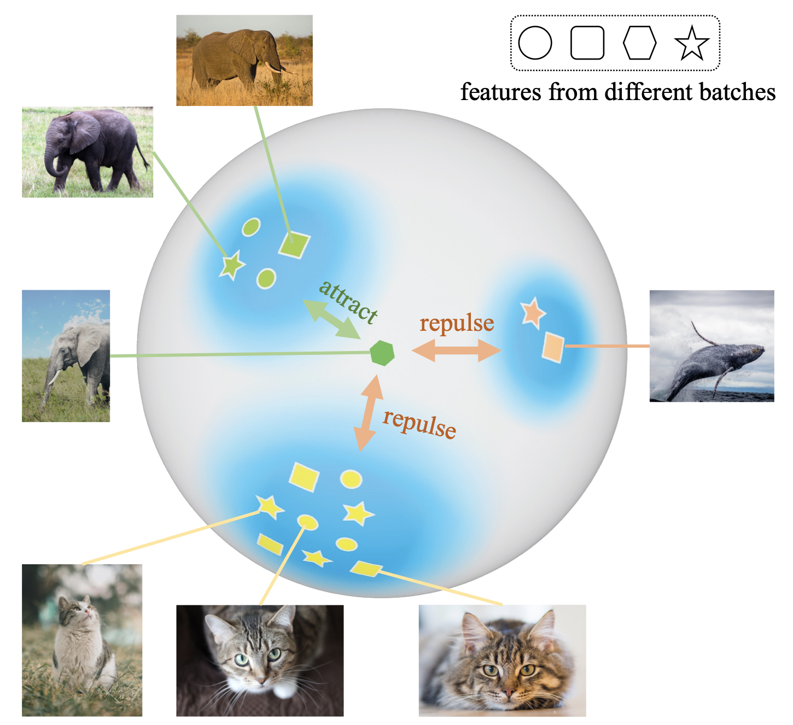

---

#### InfoPro: Locally Supervised Deep Learning by Maximizing Information Propagation
[<a href="https://link.springer.com/article/10.1007/s11263-024-02296-0">paper link</a>] | [<a href="https://github.com/blackfeather-wang/InfoPro-Pytorch">code link</a>]

Bib: **Yulin Wang**, Zanlin Ni, Yifan Pu, Cai Zhou, Jixuan Ying, Shiji Song, Gao Huang.

International Journal of Computer Vision (**IJCV** 2024, IF=11.6)

Tags: Efficient Learning of Foundation Models, Architecture Design for Foundation Models

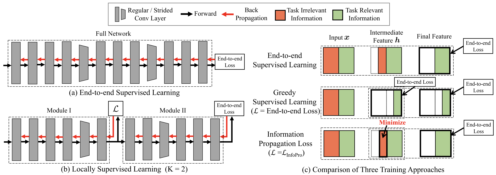

---

#### Glance and Focus Networks for Dynamic Visual Recognition
[<a href="https://arxiv.org/pdf/2201.03014.pdf">paper link</a>] | [<a href="https://github.com/blackfeather-wang/GFNet-Pytorch">code link</a>] | [<a href="https://zhuanlan.zhihu.com/p/266306870">知乎</a>]

Bib: Gao Huang*, **Yulin Wang**\*, Kangchen Lv, Haojun Jiang, Wenhui Huang, Pengfei Qi, Shiji Song. **(\*co-first author with my advisor)**

IEEE Transactions on Pattern Analysis and Machine Intelligence (**TPAMI** 2023, IF=20.8)

Tags: Dynamic Neural Networks, Architecture Design for Foundation Models, Reinforcement Learning

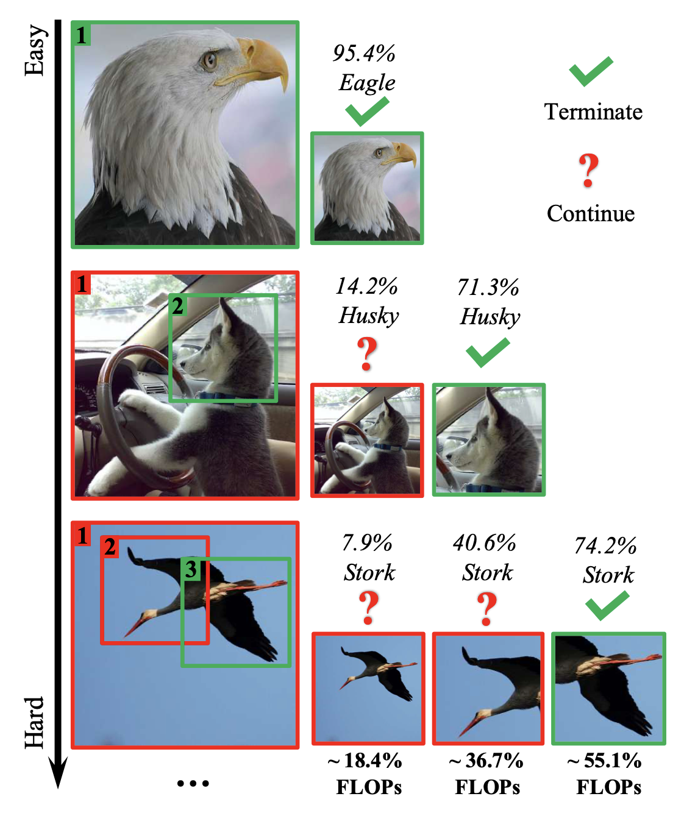

---

#### Adapting Across Domains via Target-Oriented Transferable Semantic Augmentation Under Prototype Constraint
[<a href="https://link.springer.com/article/10.1007/s11263-023-01944-1">paper link</a>] | [<a href="https://github.com/BIT-DA/TTSA">code link</a>]

Bib: Mixue Xie, Shuang Li, Kaixiong Gong, **Yulin Wang**, Gao Huang.

International Journal of Computer Vision (**IJCV** 2023, IF=11.6)

Tags: Efficient Learning of Foundation Models

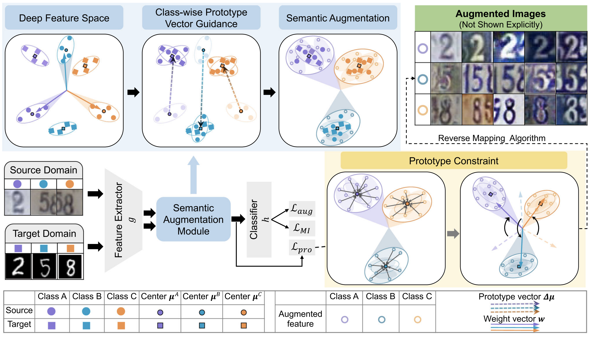

---

#### Regularizing Deep Networks with Semantic Data Augmentation
[<a href="https://arxiv.org/pdf/2007.10538.pdf">paper link</a>] | [<a href="https://github.com/blackfeather-wang/ISDA-for-Deep-Networks">code link</a>] | [<a href="https://zhuanlan.zhihu.com/p/344953635">知乎</a>]

Bib: **Yulin Wang**, Gao Huang, Shiji Song, Xuran Pan, Yitong Xia, Cheng Wu.

IEEE Transactions on Pattern Analysis and Machine Intelligence (**TPAMI** 2022, IF=20.8)

Tags: Efficient Learning of Foundation Models

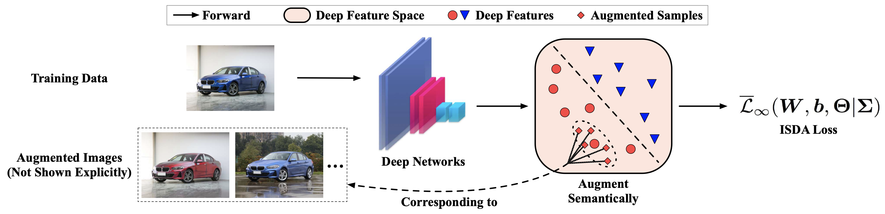

---

#### Dynamic Neural Networks: A Survey
[<a href="https://arxiv.org/pdf/2102.04906.pdf">paper link</a>] | [<a href="https://mp.weixin.qq.com/s/TG_HBAR7Jrec4X02sxNGEA">智源社区</a>]

Bib: Yizeng Han, Gao Huang, Shiji Song, Le Yang, Honghui Wang, **Yulin Wang**.

IEEE Transactions on Pattern Analysis and Machine Intelligence (**TPAMI** 2022, IF=20.8)

Tags: Dynamic Neural Networks, Architecture Design for Foundation Models

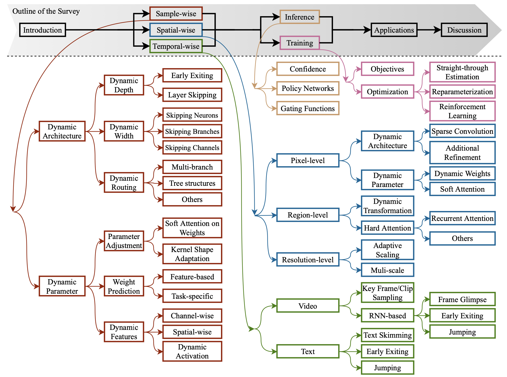

---

#### AdaFocus: Adaptive Focus for Efficient Video Recognition
[<a href="https://arxiv.org/pdf/2105.03245.pdf">paper link</a>] | [<a href="https://github.com/blackfeather-wang/AdaFocus">code link</a>] | [<a href="https://drive.google.com/file/d/1cJ1ezpQ0bXDq08ajNln94kTJFgspRaKv/view?usp=sharing">poster link</a>] | [<a href="https://zhuanlan.zhihu.com/p/416704427">知乎</a>] | [<a href="https://www.bilibili.com/video/BV1vb4y1a7sD/">Bilibili</a>]

Bib: **Yulin Wang**, Zhaoxi Chen, Haojun Jiang, Shiji Song, Yizeng Han, Gao Huang.

IEEE/CVF International Conference on Computer Vision (ICCV 2021, **Oral Presentation**)

Tags: Dynamic Neural Networks, Architecture Design for Foundation Models, Reinforcement Learning

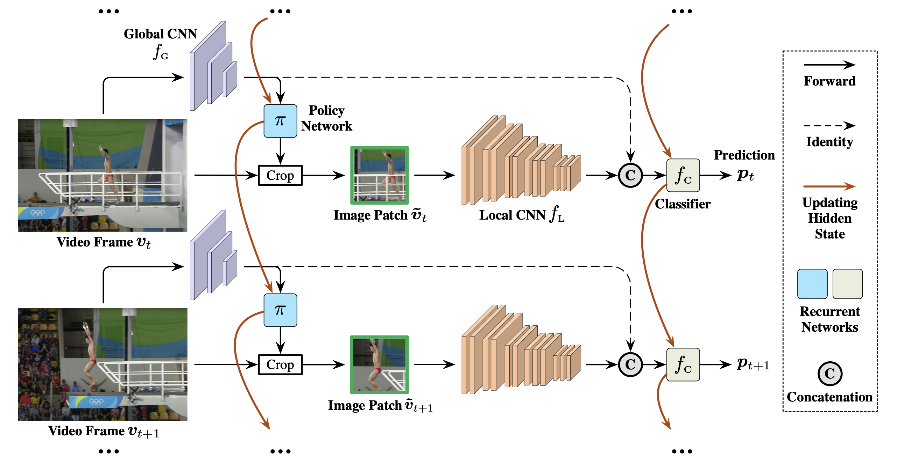

---

#### Transferable Semantic Augmentation for Domain Adaptation
[<a href="https://arxiv.org/pdf/2103.12562.pdf">paper link</a>] | [<a href="https://github.com/BIT-DA/TSA">code link</a>]

Bib: Shuang Li, Mixue Xie, Kaixiong Gong, Chi Harold Liu, **Yulin Wang**, Wei Li.

IEEE/CVF Conference on Computer Vision and Pattern Recognition (CVPR 2021, **Oral Presentation**)

Tags: Efficient Learning of Foundation Models

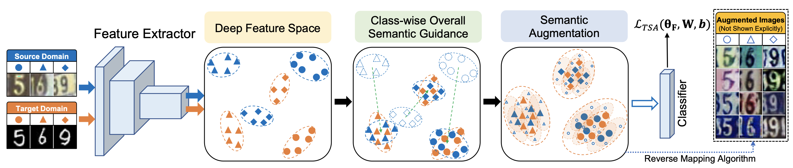

### Highlights
<ul>
   <li>National Scholarship, Ministry of Education of China, 2023   
      (国家奖学金, <b>4th time</b>, <b>Top 2% in Tsinghua University</b>)</li>
 <li><a href="https://ur.bytedance.com/scholarship">ByteDance Scholarship</a>, ByteDance Ltd., 2022  
   (字节跳动奖学金, <b>10 PhD students in China</b>)</li>
 <li><a href="https://www.msra.cn/zh-cn/news/features/2022-fellows">Microsoft Research Asia Fellowship Award</a>, Microsoft Research Asia, 2022  
   (微软学者, <b>12 PhD students in the Asia-Pacific region</b>)</li>
 <li><a href="https://mp.weixin.qq.com/s/1Qkc2mZ_MJ2hKNZZDT7RQA">Baidu Scholarship</a>, Baidu Inc., 2021   
   (百度奖学金, <b>10 PhD students worldwide</b>)</li>
 <li><a href="https://tc.ccf.org.cn/ccfcv/xgzy/timing/2021-05-04/697856.shtml">CCF-CV Outstanding Young Researcher Award</a>, China Computer Federation (CCF), 2021   
   (CCF-CV学术新锐奖, <b>3 PhD or Master students in China</b>)</li>
 <li>National Scholarship, Ministry of Education of China, 2021   
   (国家奖学金, <b>3rd time</b>, <b>Top 2% in Tsinghua University</b>)</li>
    <li>Outstanding Reviewer, CVPR, 2021</li>
    <li>Travel Award, NeurIPS, 2019</li>
    <li>“Shen Yuan” Medal, Beihang University, 2018   
      (沈元奖章，<b>Top 10 of 18,000+ undergraduate students in Beihang University</b>)</li>
  <li>National Scholarship, Ministry of Education of China, 2018   
   (国家奖学金, <b>2nd time</b>, <b>Top 2% in Beihang University</b>)</li>
  <li>National Scholarship, Ministry of Education of China, 2017   
   (国家奖学金, <b>1st time</b>, <b>Top 2% in Beihang University</b>)</li>
 </ul>