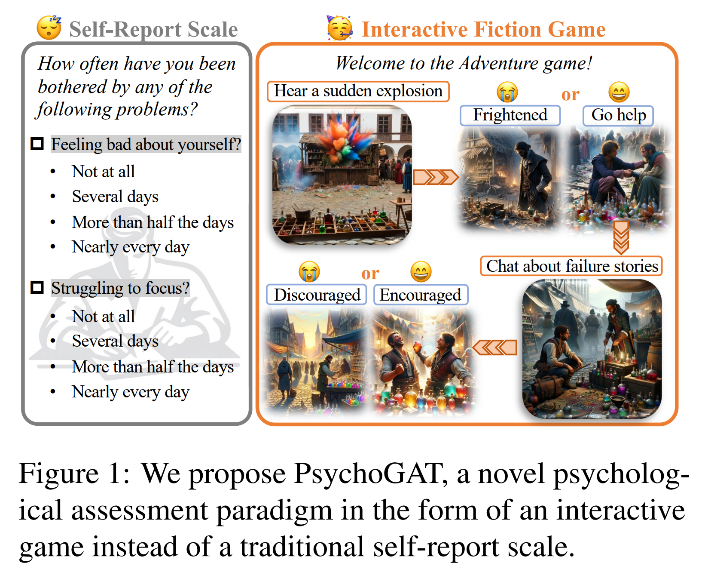
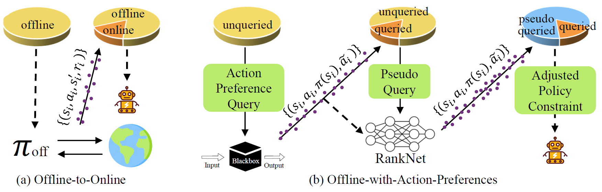
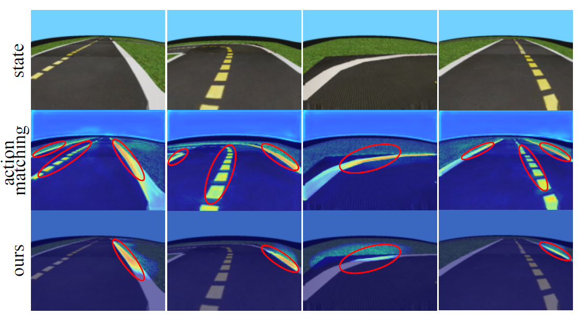
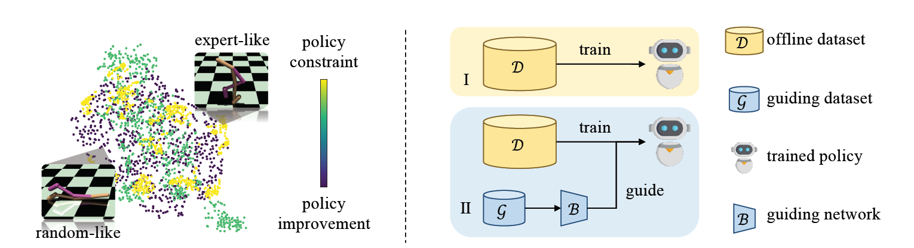
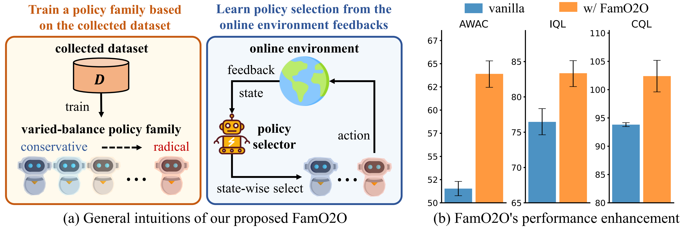
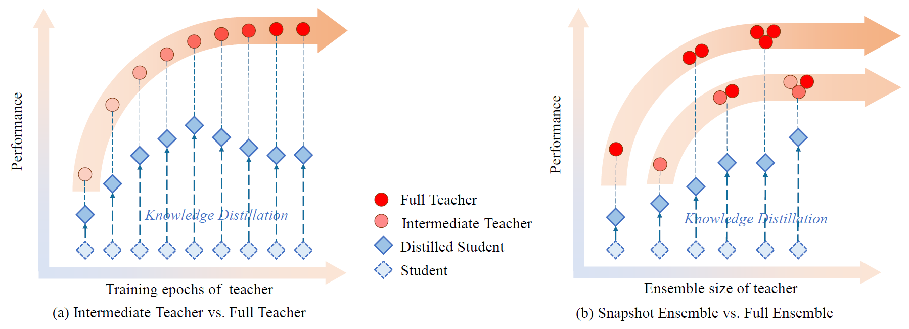

## Qisen Yang

<a href="keysayoung@gamil.com">Email</a>

### Tags
Reinforcement Learning, LLM-based Agents, AI & Psychology

### Membership
PhD Students

### Links

<a href="https://qisen-yang.netlify.app/">Personal HomePage</a>
<a href="https://scholar.google.com/citations?user=VwblgV0AAAAJ">Google Scholar</a>

### Publications

#### PsychoGAT: A Novel Psychological Measurement Paradigm through Interactive Fiction Games with LLM Agents
[<a href="https://aclanthology.org/2024.acl-long.779.pdf">paper</a>]

Bib: Qisen Yang*, Zekun Wang*, Honghui Chen, Shenzhi Wang, Yifan Pu, Xin Gao, Wenhao Huang, Shiji Song, Gao Huang.
Proceedings of the AAAI Conference on Artificial Intelligence (ACL 2024)

Tags: Large Models and Applications (LLM, MLLM, VLM, VLA, Agents)

#### Boosting Offline Reinforcement Learning with Action Preference Query
[<a href="https://proceedings.mlr.press/v202/yang23o/yang23o.pdf">paper</a>]

Bib: Qisen Yang*, Shenzhi Wang*, Matthieu Gaetan Lin, Shiji Song, Gao Huang (ICML 2023)

Tags: Reinforcement Learning

#### Leveraging reward consistency for interpretable feature discovery in reinforcement learning
[<a href="https://arxiv.org/pdf/2309.01458">paper</a>]

Bib: Qisen Yang, Huanqian Wang, Mukun Tong, Wenjie Shi, Gao Huang, Shiji Song (TSMC-A)

Tags: Reinforcement Learning

#### Hundreds guide millions: Adaptive offline reinforcement learning with expert guidance
[<a href="https://arxiv.org/pdf/2309.01448">paper</a>]

Bib: Qisen Yang*, Shenzhi Wang*, Qihang Zhang*, Gao Huang, Shiji Song (TNNLS)

Tags: Reinforcement Learning

#### Train once, get a family: State-adaptive balances for offline-to-online reinforcement learning
[<a href="https://proceedings.neurips.cc/paper_files/paper/2023/file/9318763d049edf9a1f2779b2a59911d3-Paper-Conference.pdf">paper</a>]

Bib: Shenzhi Wang*, Qisen Yang*, Jiawei Gao, Matthieu Lin, Hao Chen, Liwei Wu, Ning Jia, Shiji Song, Gao Huang (NeurIPS 2023)

Tags: Reinforcement Learning

#### Efficient knowledge distillation from model checkpoints
[<a href="https://proceedings.neurips.cc/paper_files/paper/2022/file/03e0712bf85ebe7cec4f1a7fc53216c9-Paper-Conference.pdf">paper</a>]

Bib: Chaofei Wang*, Qisen Yang*, Rui Huang, Shiji Song, Gao Huang (NeurIPS 2022)

Tags: Efficient Deep Learning

