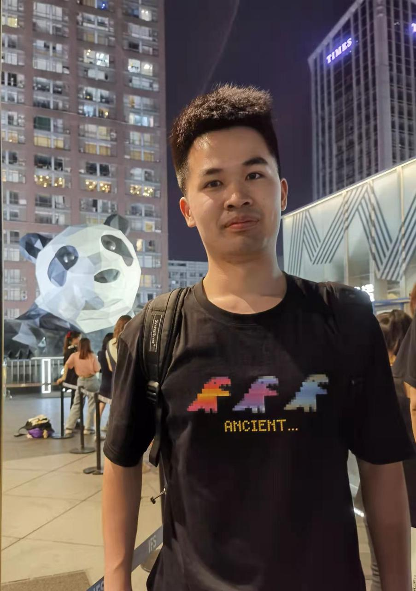

## Yang Yue (乐阳)

### Bio

Yang Yue is a third-year Ph.D. student in the Department of Automation at Tsinghua University, advised by Prof. Gao Huang. Prior to this, he earned a Bachelor of Engineering in Computer Science and and a Bachelor of Science in Mathematics, both from Tsinghua University.

### Tags
Representation Learning, Efficient Learning, Medical Image Analysis.

### Membership
PhD Students

### Links

<a href="https://scholar.google.com/citations?user=Q9cLkdcAAAAJ">Google Scholar</a>

### Publications

#### Uni-AdaFocus: Spatial-Temporal Dynamic Computation for Video Recognition

 [paper_links](https://ieeexplore.ieee.org/abstract/document/10787270)

Bib: Y Wang, H Zhang, Y Yue, S Song, C Deng, J Feng, G Huang (T-PAMI 2024)

#### EfficientTrain++: Generalized Curriculum Learning for Efficient Visual Backbone Training 

[paper_links](https://ieeexplore.ieee.org/abstract/document/10530470)

Bib: Y Wang, Y Yue, R Lu, Y Han, S Song, G Huang (T-PAMI 2024)

#### EfficientTrain: Exploring Generalized Curriculum Learning for Training Visual Backbones

[paper_links](https://openaccess.thecvf.com/content/ICCV2023/papers/Wang_EfficientTrain_Exploring_Generalized_Curriculum_Learning_for_Training_Visual_Backbones_ICCV_2023_paper.pdf)

Bib: Yulin Wang\*, Yang Yue\*, Rui Lu, Tianjiao Liu, Zhao Zhong, Shiji Song, Gao Huang (ICCV 2023)

#### Confidence-based Reliable Learning under Dual Noises 

[paper_links](https://proceedings.neurips.cc/paper_files/paper/2022/file/e444859b2a22df6b56af9381ad1e9480-Paper-Conference.pdf)

Bib: Peng Cui, Yang Yue, Zhijie Deng, Jun Zhu (Neurips 2022)

#### AdaFocusV3: On Unified Spatial-temporal Dynamic Video Recognition

[paper_links](https://arxiv.org/pdf/2209.13465)

Bib: Yulin Wang\*, Yang Yue\*, Xinhong Xu, Ali Hassani, Victor Kulikov, Nikita Orlov, Shiji Song, Humphrey Shi, Gao Huang (ECCV 2022)

#### Adafocus v2: End-to-end training of spatial dynamic networks for video recognition

[paper_links](https://arxiv.org/pdf/2112.14238)

Bib: Yulin Wang\*, Yang Yue\*, Yuanze Lin, Haojun Jiang, Zihang Lai, Victor Kulikov, Nikita Orlov, Humphrey Shi, Gao Huang (CVPR 2022)

