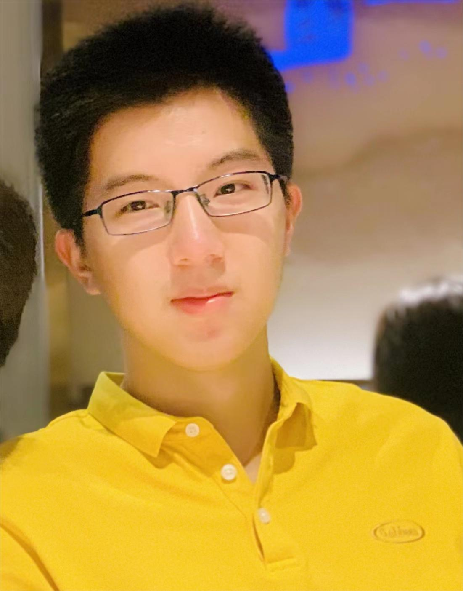
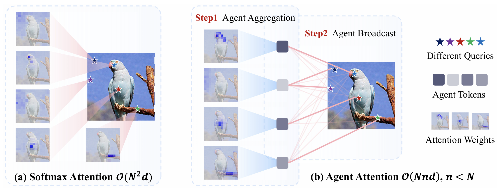
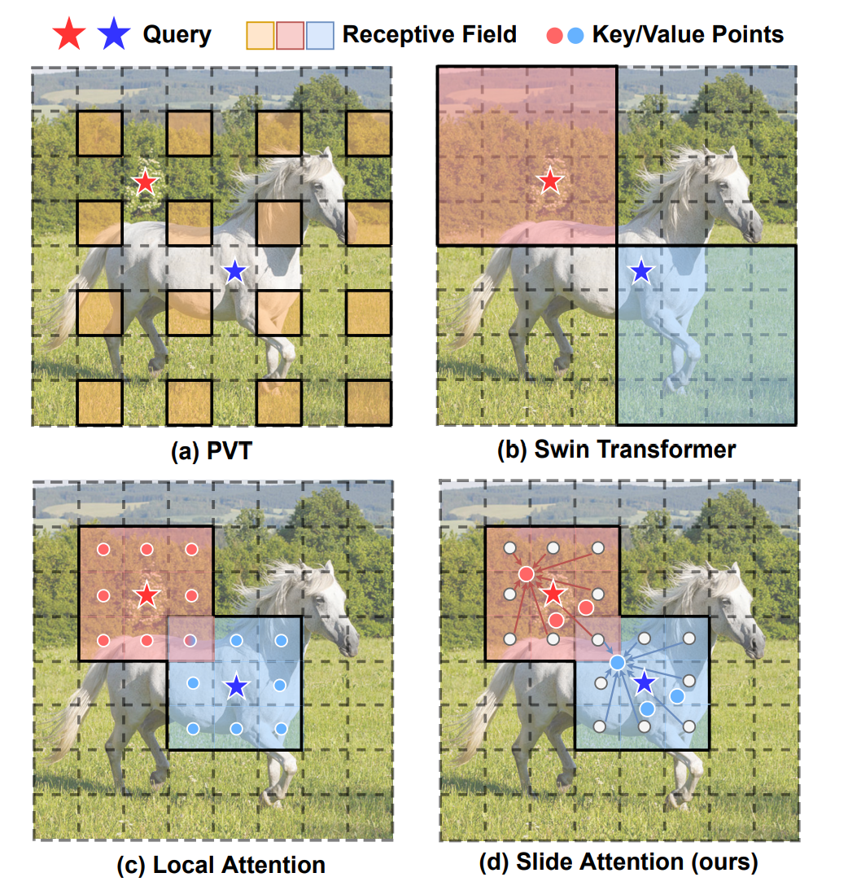

## Tianzhu Ye

  

### Bio

Tianzhu Ye is a first-year Ph.D. in the Department of Automation at Tsinghua University, under the supervision of Prof. Gao Huang. He received Bachelor’s degree in Automation at Tsinghua University in 2024. His research focuses on foundation model design across different modalities.

### Tags
Architecture Design for Foundation Models

### Membership
PhD Student

### Links

<a href="https://ytianzhu.github.io/">Personal HomePage</a>
<a href="https://scholar.google.com/citations?user=7X8BCBsAAAAJ&hl">Google Scholar</a>

### Publications
#### Differential Transformer
[<a href="https://arxiv.org/abs/2410.05258">paper</a>]
[<a href="https://aka.ms/Diff-Transformer">code</a>]

Authors: Tianzhu Ye, Li Dong, Yuqing Xia, Yutao Sun, Yi Zhu, Gao Huang, Furu Wei
Conference/Journal: In submission

Tags: Architecture Design for Foundation Models

#### Agent Attention: On the Integration of Softmax and Linear Attention
[<a href="https://arxiv.org/abs/2312.08874">paper</a>]
[<a href="https://github.com/LeapLabTHU/Agent-Attention">code</a>]

Authors: Dongchen Han, Tianzhu Ye, Yizeng Han, Zhuofan Xia, Shiji Song, Gao Huang.
Conference/Journal: European Conference on Computer Vision (ECCV) 2024

Tags: Architecture Design for Foundation Models

#### Slide-Transformer: Hierarchical Vision Transformer with Local Self-Attention
[<a href="https://arxiv.org/abs/2304.04237">paper</a>]
[<a href="https://github.com/LeapLabTHU/Slide-Transformer">code</a>]

Authors: Xuran Pan, Tianzhu Ye, Zhuofan Xia, Shiji Song, Gao Huang.
Conference/Journal: Conference on Computer Vision and Pattern Recognition (CVPR) 2023

Tags: Architecture Design for Foundation Models

  

