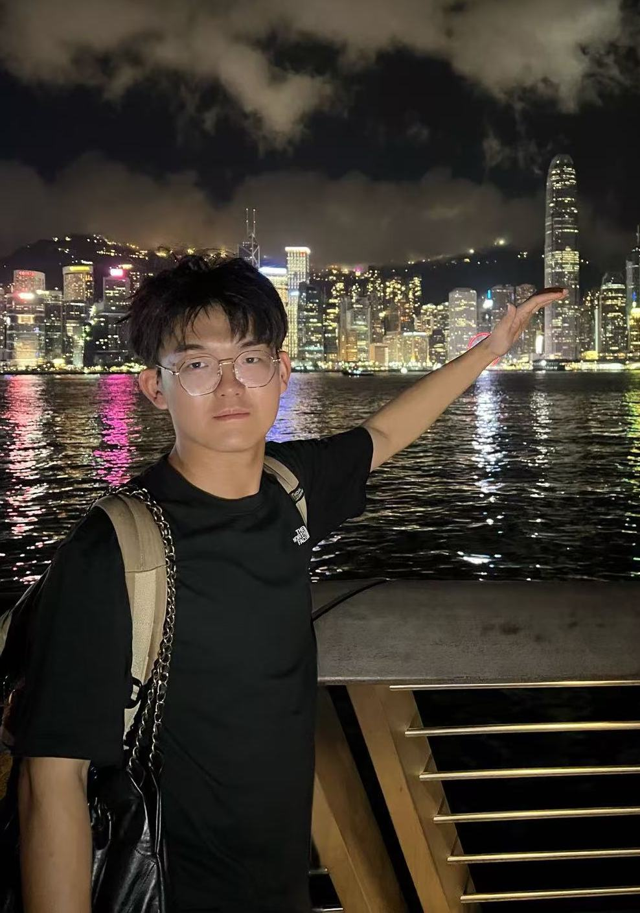
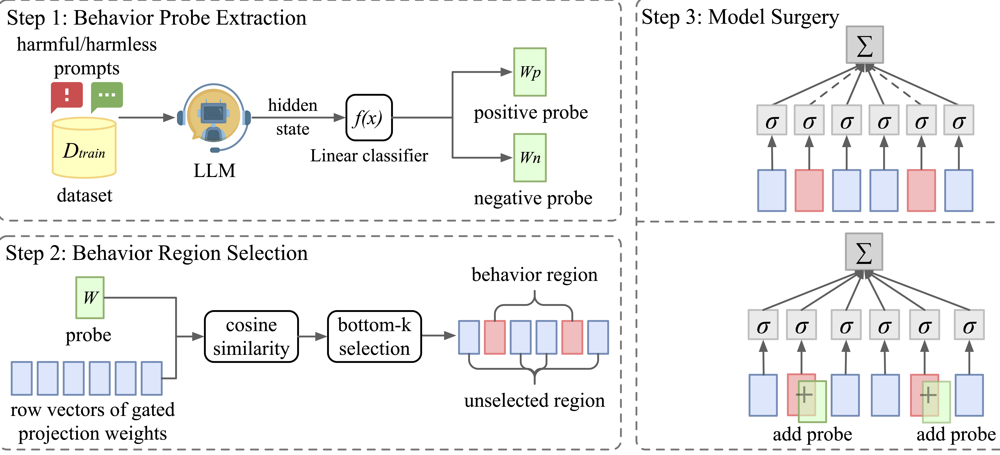
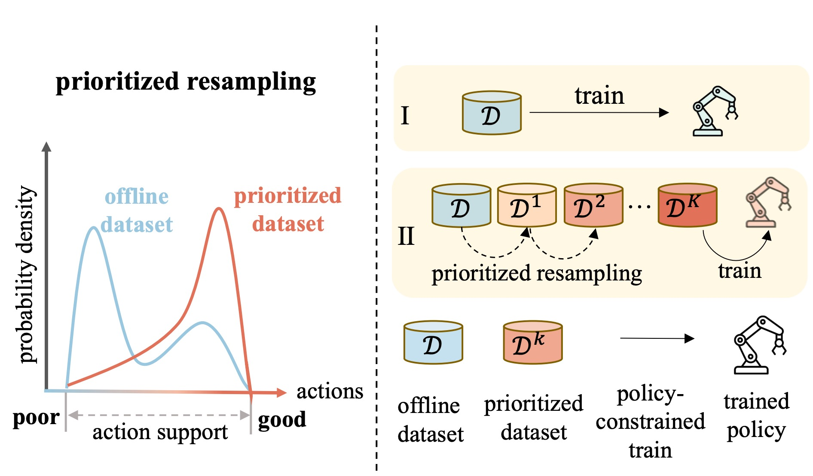
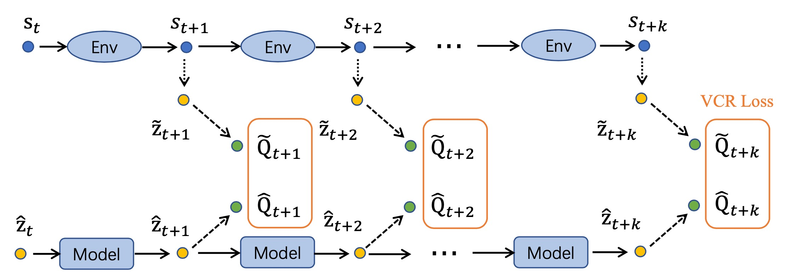

## Yang Yue (乐洋)

<a href="yueyang22f@gmail.com">email</a>

### Tags
Reinforcement Learning, Multimodal LLMs, World Models, Embodied AI

### Membership
PhD Students

### Links

<a href="https://yueyang130.github.io/">Personal HomePage</a>
<a href="https://scholar.google.com/citations?user=tE1oVQ4AAAAJ&hl=zh">Google Scholar</a>

### Publications
#### HOW FAR IS VIDEO GENERATION FROM WORLD MODEL: A PHYSICAL LAW PERSPECTIVE
[<a href="https://arxiv.org/abs/2411.02385">paper</a>]
[<a href="https://phyworld.github.io/">project page</a>]
[<a href="https://github.com/phyworld/phyworld">code</a>]

Bib: Bingyi Kang\*, **Yang Yue\* (Equal contribution in alphabetical order)**, Rui Lu, Zhijie Lin, Yang Zhao, Kaixin Wang, Gao Huang, Jiashi Feng.
arXiv Preprint

Tags: World models, Video Generation, Physical Law

#### DeeR-VLA: Dynamic Inference of Multimodal Large Language Models for Efficient Robot Execution
[<a href="https://arxiv.org/abs/2411.02359">paper</a>]
[<a href="https://github.com/yueyang130/DeeR-VLA">code</a>]

Bib: **Yang Yue\***, Yulin Wang*, Bingyi Kang, Yizeng Han, Shenzhi Wang, Shiji Song, Jiashi Feng, Gao Huang.
Advances in Neural Information Processing Systems (NeurIPS), 2024

Tags: Multimodal LLM, VLA, Emobided AI, Dynamic Network

#### Model Surgery: Modulating LLM's Behavior Via Simple Parameter Editing

[<a href="https://arxiv.org/pdf/2407.08770">paper</a>]
[<a href="https://github.com/lucywang720/model-surgery">code</a>]

Bib: Huanqian Wang*, **Yang Yue\***, Rui Lu, Jingxin Shi, Andrew Zhao, Shenzhi Wang, Shiji Song, Gao Huang
arXiv Preprint.

Tags: LLM finetuning

#### Understanding, Predicting and Better Resolving Q-Value Divergence in Offline-RL
[<a href="https://arxiv.org/abs/2310.04411">paper</a>]
[<a href="https://offrl-seem.github.io/">page</a>]
[<a href="https://github.com/yueyang130/SEEM/">code</a>]

Bib:**Yang Yue\***, Rui Lu*, Bingyi Kang*, Shiji Song, Gao Huang.
Advances in Neural Information Processing Systems (NeurIPS), 2023

Tags: Offline Reinforcement Learning

#### Decoupled Prioritized Resampling for Offline RL
[<a href="https://arxiv.org/abs/2306.05412">paper</a>]
[<a href="https://github.com/yueyang130/ODPR">code</a>]

Bib: **Yang Yue**, Bingyi Kang, Xiao Ma, Qisen Yang, Gao Huang, Shiji Song, Shuicheng Yan.
IEEE Transactions on Neural Networks and Learning Systems (TNNLS)

Tags: Offline Reinforcement Learning

#### Value-consistent Representation Learning for Data-Efficient Reinforcement Learning
[<a href="https://arxiv.org/abs/2206.12542">paper</a>]

Bib: **Yang Yue**, Bingyi Kang, Zhongwen Xu, Gao Huang, Shuicheng Yan.
Thirty-Eighth AAAI Conference on Artificial Intelligence (AAAI 2023) (Oral)

Tags: Data-efficient Reinforcement Learning, Self-supervised Learning

