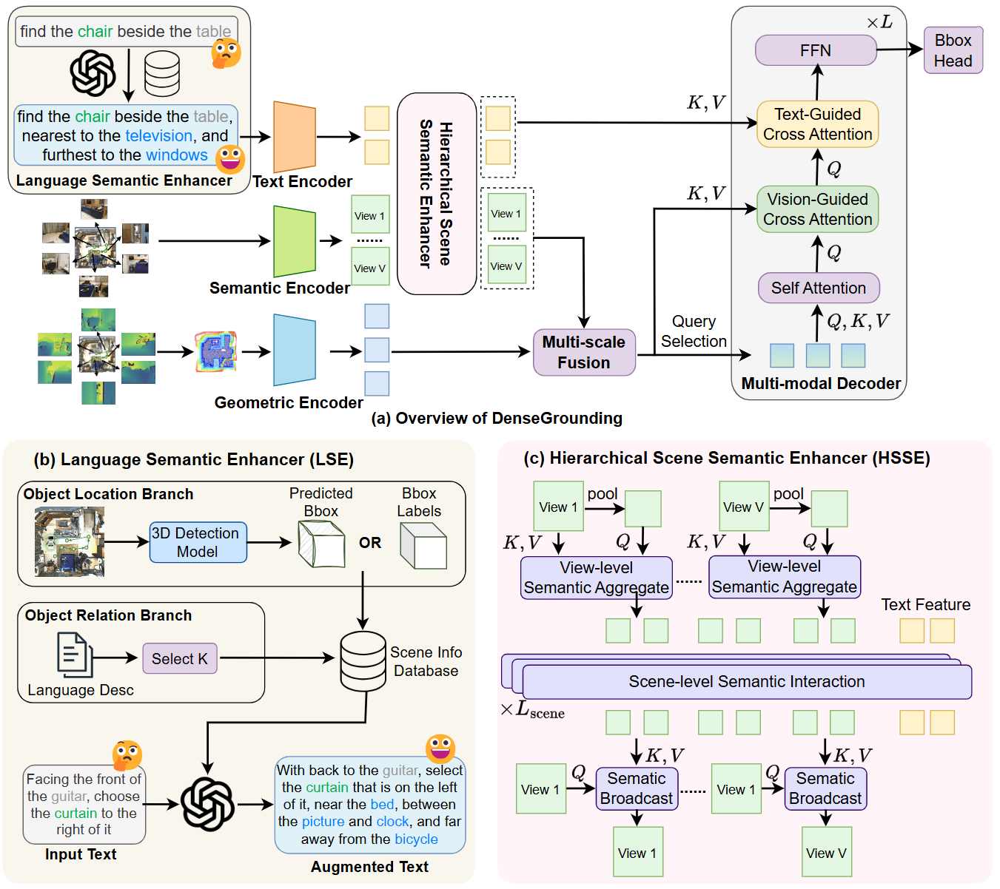

## Henry Zheng (郑嘉恒)

<a href="jh-zheng22@mails.tsinghua.edu.cn">Email</a>

### Bio

Henry Zheng is an PHD Student at Tsinghua University, specializing in 3D Vision and Multi-modal Learning.

### Tags
3D Vision, Multi-modal Learning

### Membership
PHD Student

### Links

<a href="https://scholar.google.com/citations?view_op=list_works&hl=en&user=gZCggycAAAAJ">Google Scholar</a>

<a href="https://www.linkedin.com/in/henry-zheng-70ab2aa1/">LinkedIn</a>

### Publications

#### DenseGrounding: Improving Dense Language-Vision Semantics for Ego-centric 3D Visual Grounding

Bib: **Henry Zheng***, Hao Shi*, Yong Xien Chng, Rui Huang, Zanlin Ni, Tianyi Tan, Qihang Peng, Yepeng Weng, Zhongchao Shi, Gao Huang

[Full Version] [<a href="https://opendrivelab.github.io/Challenge%202024/multiview_THU-LenovoAI.pdf">Workshop Version</a>]

Under Review

Tags: 3D Perception and Spatial Intelligence

### Highlights
CVPR AGC2024 Challenge Champion + Innovation Award. 

[<a href="https://opendrivelab.com/challenge2024/#multiview_3d_visual_grounding"> 🆚 Challenge Link </a>] [<a href="https://opendrivelab.github.io/Challenge%202024/multiview_THU-LenovoAI.pdf"> 📄 Paper Link </a>]
