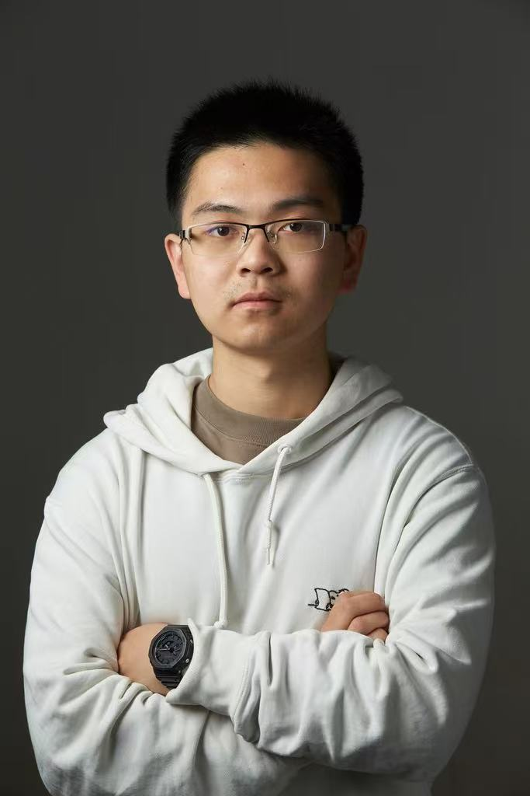
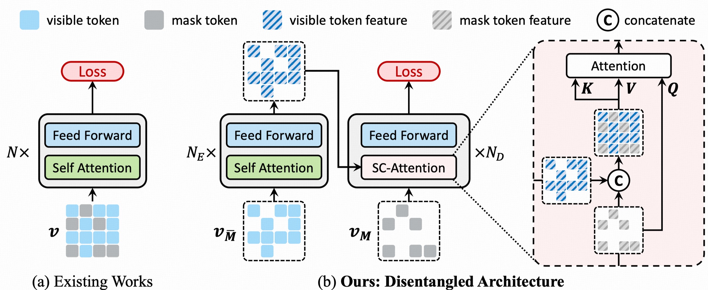
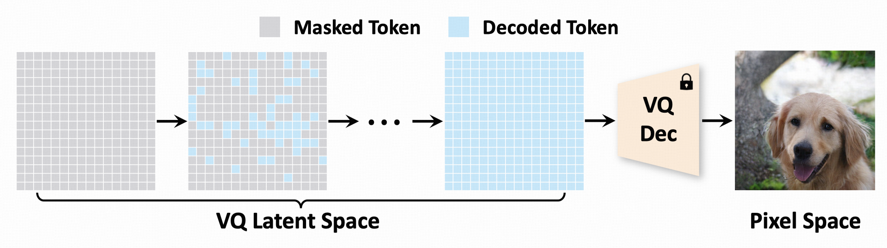

## Renping Zhou

<a herf="zrp21@mails.tsinghua.edu.cn">zrp21@mails.tsinghua.edu.cn</a>

### Bio
Renping Zhou is a senior undergraduate student at Tsinghua University, majoring in Computer Science and Technology and minoring in Statistics. Currently, he is working under the supervision of Prof. Gao Huang. His research interests includes topics on deep generative models and their applications in Computer Vision and Embodied AI.

### Tags
Generative Models, World Model, Spatial Intelligence

### Membership
intern/visiting student

### Links
<a herf="https://zrp21.notion.site/">Personal HomePage</a>

<a herf="https://scholar.google.com/citations?user=zNc7Eg8AAAAJ"/>Google Scholar</a>

### Publications

#### ENAT: Rethinking Spatial-temporal Interactions in Token-based Image Synthesis
[<a href="https://arxiv.org/pdf/2411.06959">paper</a>]
[<a href="https://github.com/LeapLabTHU/ENAT">code</a>]

Bib: Zanlin Ni*, Yulin Wang*, Renping Zhou, Yizeng Han, Jiayi Guo, Zhiyuan Liu, Yuan Yao, Gao Huang.
The Thirty-Eighth Annual Conference on Neural Information Processing Systems (NeurIPS 2024)

Tags: Visual Generative Models

#### AdaNAT: Exploring Adaptive Policy for Token-Based Image Generation
[<a href="https://arxiv.org/pdf/2409.00342">paper</a>]
[<a href="https://github.com/LeapLabTHU/AdaNAT/">code</a>]

Bib: Zanlin Ni, Yulin Wang, Renping Zhou, Rui Lu, Jiayi Guo, Jinyi Hu, Zhiyuan Liu, Yuan Yao, Gao Huang.
European Conference on Computer Vision (ECCV 2024)

Tags: Visual Generative Models

#### Revisiting Non-Autoregressive Transformers for Efficient Image Synthesis
[<a href="https://arxiv.org/pdf/2101.10832">paper</a>]
[<a href="https://github.com/LeapLabTHU/ImprovedNAT">code</a>]

Bib: Zanlin Ni*, Yulin Wang*, Renping Zhou, Jiayi Guo, Jinyi Hu, Zhiyuan Liu, Shiji Song, Yuan Yao, Gao Huang.
IEEE Conference on Computer Vision and Pattern Recognition (CVPR 2024)

Tags: Visual Generative Models

