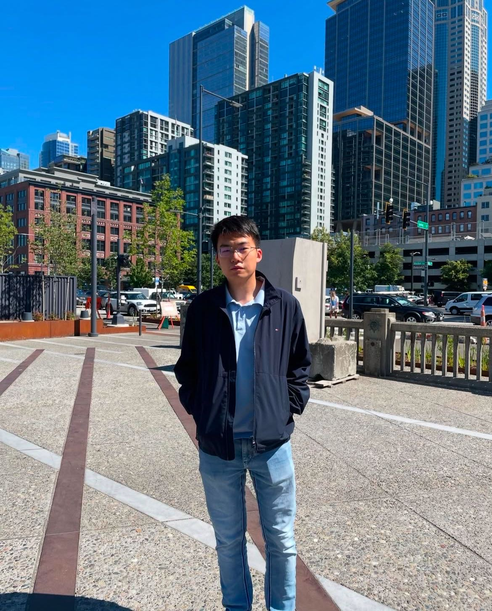
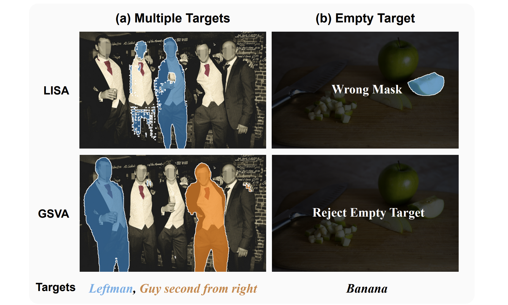
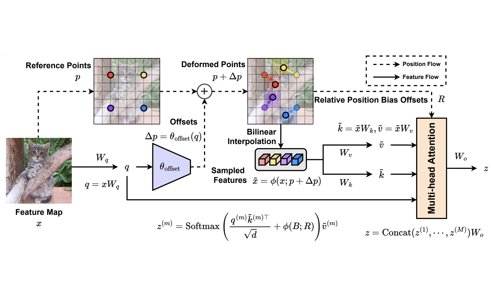
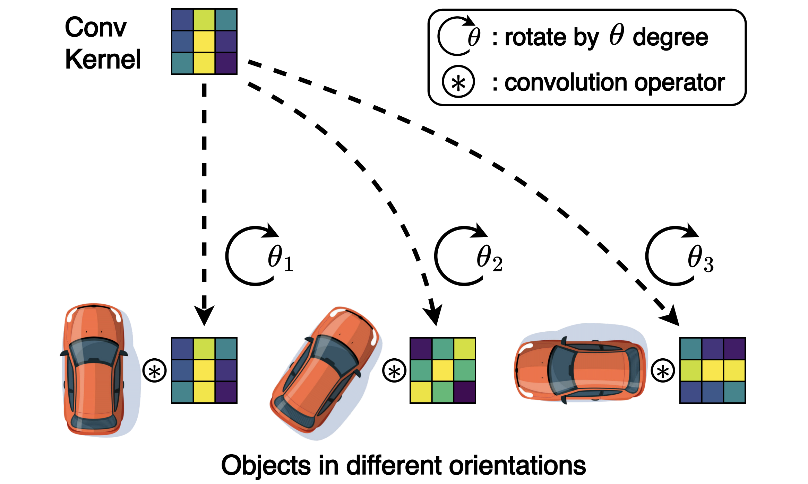
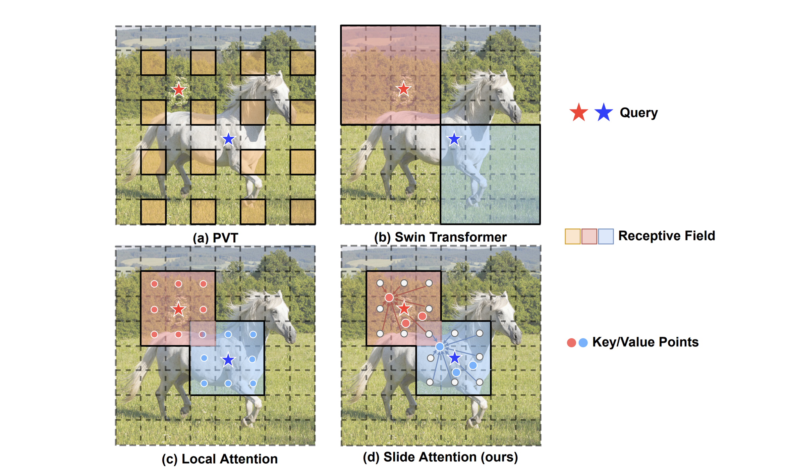
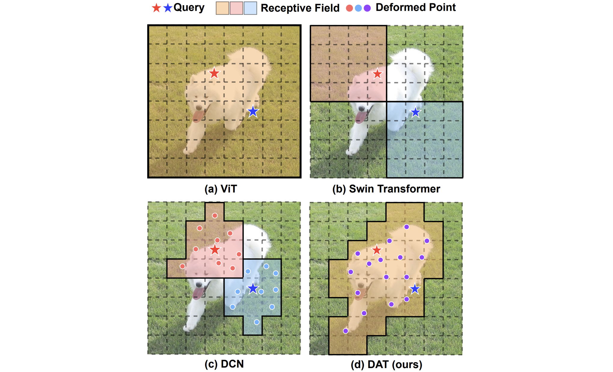
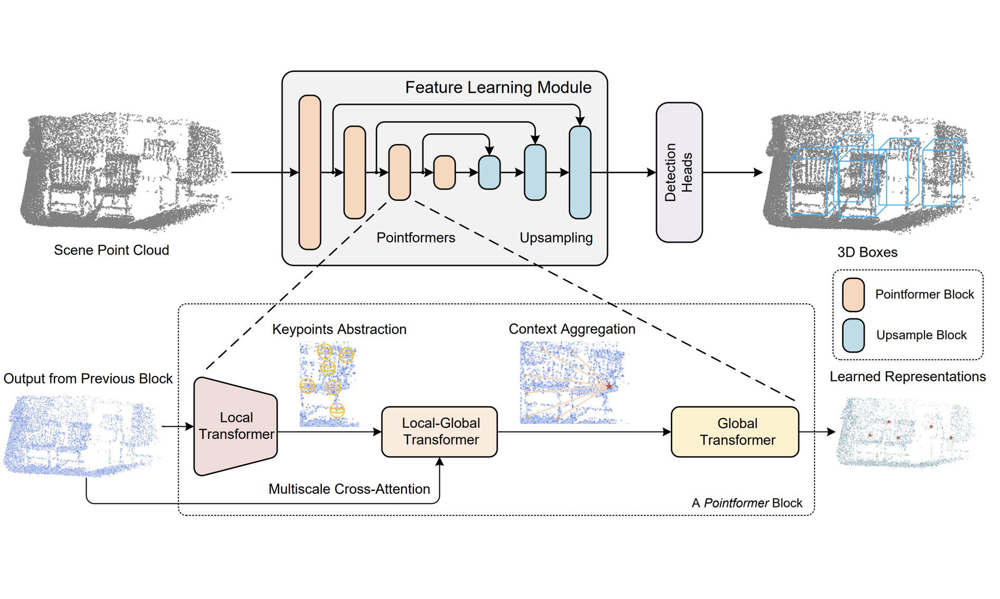
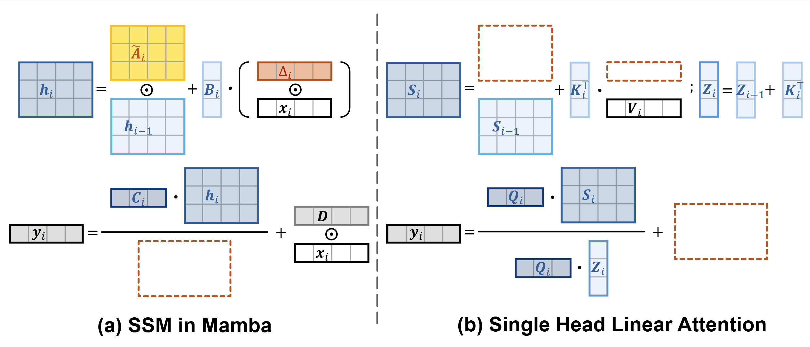

## Zhuofan Xia

### Bio

My name is **Zhuofan Xia**. I'm currently a 5th-year Ph.D. candidate at Department of Automation, Tsinghua University, advised by Prof. [Gao Huang](https://www.gaohuang.net/) and Prof. [Shiji Song](https://www.au.tsinghua.edu.cn/info/1075/3206.htm). Before that, I did my bachelor degree in Automation at Tsinghua University in 2020. My research mainly focuses on deep learning on computer vision, and multimodal learning. Specifically, my research interests lie in the Vision Transformers (2D / 3D), dynamic neural architectures, and large multimodal models. Currently, I am focusing on the topics related to dynamic and efficient large multimodal models.

### Tags
Multimodal Learning, Efficient Deep Learning

### Membership
Ph.D. Student

### Links

<a href="https://zhuofanxia.xyz">Personal Homepage</a>

### Publications

*: equal contribution, †: corresponding author.

For full publication list, please check my [Google Scholar](https://scholar.google.com/citations?user=m2M6b58AAAAJ) profile.

ECCV 2024

[Agent Attention: On the Integration of Softmax and Linear Attention](https://arxiv.org/pdf/2312.08874.pdf)

*European Conference on Computer Vision (**ECCV**), 2024*

Dongchen Han\*, Tianzhu Ye\*, Yizeng Han, **Zhuofan Xia**, Shiji Song, Gao Huang†

[\[arXiv\]](https://arxiv.org/abs/2312.08874) [\[GitHub\]](https://github.com/LeapLabTHU/Agent-Attention)

CVPR 2024

[GSVA: Generalized Segmentation via Multimodal Large Language Models](https://arxiv.org/pdf/2312.10103.pdf)

*IEEE/CVF Conference on Computer Vision and Pattern Recognition (**CVPR**), 2024*

**Zhuofan Xia\***, Dongchen Han\*, Yizeng Han, Xuran Pan, Shiji Song, Gao Huang†

[\[arXiv\]](https://arxiv.org/abs/2312.10103) [\[GitHub\]](https://github.com/LeapLabTHU/GSVA)

Preprint

[DAT++: Spatially Dynamic Vision Transformer with Deformable Attention](https://arxiv.org/pdf/2309.01430.pdf)

*Preprint*

**Zhuofan Xia**, Xuran Pan, Shiji Song, Li Erran Li, Gao Huang†

[\[arXiv\]](https://arxiv.org/abs/2309.01430) [\[GitHub\]](https://github.com/LeapLabTHU/DAT)

ICCV 2023

[Adaptive Rotated Convolution for Rotated Object Detection](https://openaccess.thecvf.com/content/ICCV2023/papers/Pu_Adaptive_Rotated_Convolution_for_Rotated_Object_Detection_ICCV_2023_paper.pdf)

*IEEE/CVF International Conference on Computer Vision (**ICCV**), 2023*

Yifan Pu\*, Yiru Wang\*, **Zhuofan Xia**, Yizeng Han, Yulin Wang, Weihao Gan, Zidong Wang, Shiji Song, Gao Huang†

[\[arXiv\]](https://arxiv.org/abs/2303.07820) [\[GitHub\]](https://github.com/LeapLabTHU/ARC)

CVPR 2023

[Slide-Transformer: Hierarchical Vision Transformer with Local Self-Attention
](https://openaccess.thecvf.com/content/CVPR2023/papers/Pan_Slide-Transformer_Hierarchical_Vision_Transformer_With_Local_Self-Attention_CVPR_2023_paper.pdf)

*IEEE/CVF Conference on Computer Vision and Pattern Recognition (**CVPR**), 2023*

Xuran Pan\* Tianzhu Ye\*, **Zhuofan Xia**, Shiji Song, Gao Huang†

[\[arXiv\]](https://arxiv.org/abs/2304.04237) [\[GitHub\]](https://github.com/LeapLabTHU/Slide-Transformer)

ICLR 2023

[Budgeted Training for Vision Transformer](https://openreview.net/pdf?id=sVzBN-DlJRi)

*International Conference on Learning Representations (**ICLR**), 2023*

**Zhuofan Xia\***, Xuran Pan\*, Xuan Jin\*, Yuan He, Hui Xue, Shiji Song, Gao Huang†

CVPR 2022

[Vision Transformer with Deformable Attention](https://openaccess.thecvf.com/content/CVPR2022/papers/Xia_Vision_Transformer_With_Deformable_Attention_CVPR_2022_paper.pdf)

*IEEE/CVF Conference on Computer Vision and Pattern Recognition (**CVPR**), 2022*

**Best Paper Finalists (0.4%)**

**Zhuofan Xia\***, Xuran Pan\*, Shiji Song, Li Erran Li, Gao Huang†

[\[arXiv\]](https://arxiv.org/abs/2201.00520) [\[GitHub\]](https://github.com/LeapLabTHU/DAT)

CVPR 2021

[3D Object Detection with Pointformer](https://openaccess.thecvf.com/content/CVPR2021/papers/Pan_3D_Object_Detection_With_Pointformer_CVPR_2021_paper.pdf)

*IEEE/CVF Conference on Computer Vision and Pattern Recognition (**CVPR**), 2021*

Xuran Pan\*, **Zhuofan Xia\***, Shiji Song, Li Erran Li, Gao Huang†

[\[arXiv\]](https://arxiv.org/abs/2201.00520) [\[GitHub\]](https://github.com/LeapLabTHU/DAT)

Preprint

[Demystify Mamba in Vision: A Linear Attention Perspective](https://arxiv.org/pdf/2405.16605)

*Preprint*

Dongchen Han, Ziyi Wang, **Zhuofan Xia**, Yizeng Han, Yifan Pu, Chunjiang Ge, Jun Song, Shiji Song, Bo Zheng, Gao Huang†

[\[arXiv\]](https://arxiv.org/abs/2405.16605) [\[GitHub\]](https://github.com/LeapLabTHU/MLLA)

### Highlights
- CVPR 2022 Best Paper Finalists